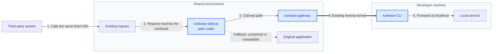

#  Tunlease

Route a path on a third party's fixed endpoint to a local development environment without asking the third party to change its URL.

<!-- Demo GIF pending re-recording. Regenerate with `vhs assets/demo.tape`,
     then re-add:  -->
_Demo: a staging callback URL returns 404 until you `tunlease claim` its path, then reaches a server on your laptop — and 404s again once released._

[Developer quick start](#quick-start-for-developers) · [Platform setup](docs/platform-deployment.md) · [Architecture](docs/architecture.md) · [Troubleshooting](docs/developer-guide.md#troubleshooting)

[English](README.md) · [繁體中文](README.zh-TW.md)



The third party keeps calling the same URL. When a developer claims a path, only that path follows the numbered route to localhost; everything else continues to the original application. Blue nodes are components owned and shipped by Tunlease. Neutral nodes already exist in the environment.

The safety model combines a path allowlist, exclusive leases with TTLs, optional token authentication, audit logs, and fail-open routing. If the development tooling fails, traffic returns to the original application.

## Quick start for developers

Once your platform team has deployed the gateway (and you know its URL), a
developer needs just two commands: install, then claim. If the gateway isn't
set up yet, see the [platform deployment guide](docs/platform-deployment.md).

```bash
# macOS and Linux
curl -fsSL https://tunlease.example.com/install/install.sh | bash
```

```powershell
# Windows PowerShell (amd64)
irm https://tunlease.example.com/install/install.ps1 | iex
```

Then claim a path in one command — point it at the gateway with `--gateway`
and forward the path to a local port with `--to`. Ctrl+C releases it.

```bash
tunlease claim /webhooks/provider/callback/* --to 8080 --gateway https://tunlease.example.com
```

Claims receive real staging callbacks, so start your local service first and
claim the narrowest path you need.

To avoid repeating `--gateway`, set it once as an environment variable:

```bash
export TUNLEASE_GATEWAY=https://tunlease.example.com
tunlease claim /webhooks/provider/callback/* --to 8080
```

Or, if you prefer a file, put it in `~/.tunlease.yaml` (a `token:` line goes
here too if the gateway requires authentication):

```yaml
gateway: https://tunlease.example.com
```

Everything else uses the same short form:

```bash
tunlease list                                    # your active claims
tunlease list --all                              # every claim on the gateway
tunlease release /webhooks/provider/callback/*   # release a path
tunlease release --to 8080                        # release everything on a port
tunlease update                                  # self-update the binary
tunlease --version
```

See the [developer guide](docs/developer-guide.md) for full usage and troubleshooting.

Windows amd64 uses Tunlease's purpose-built tunnel transport. The PowerShell installer verifies the published SHA-256 checksum and preserves the previous executable as `tunlease.exe.prev`.

## Components and deployment model

| Component | Location | Responsibility |
|---|---|---|
| `tunlease` | Developer machine | Claims, releases, reverse tunnel, and heartbeat |
| `tunlease-gateway` | Shared environment | API, lease registry, and reverse-tunnel server |
| `tunlease-sidecar` | Fixed-endpoint workload | Path routing; falls back to the original app on any failure |

None of the binaries call the Kubernetes API, so Kubernetes is not an architectural requirement. It is the recommended deployment target: deploy the gateway with Helm and add the proxy using the sidecar patch.

## Embedding the tunnel client

Go applications can embed the same claim, lease, reconnect, and tunnel engine used by the standalone CLI. Their users do not need the `tunlease` binary.

```bash
go get github.com/iml885203/tunlease/pkg/tunnelclient@latest
```

See [Embedding the Go client](docs/go-client.md) for authentication, a complete lifecycle example, API behavior, errors, upgrades, and integration testing.

## Local development

Go and Docker Compose are required. Helm and kubectl are only needed to validate deployment manifests.

Enable the formatting/vet pre-commit hook once per clone:

```bash
git config core.hooksPath .githooks
```

```bash
make build   # Build all three binaries into bin/
make test    # Run the Go test suite
make lint    # Run the pinned golangci-lint container
make preflight # Build, vet, race-test, lint, and reject formatting drift
make e2e     # Redis + gateway + sidecar + app + real CLI
```

## Documentation

Choose the shortest path for your role:

- **Team new to Tunlease:** [Adoption guide](docs/adoption-guide.md) — go from fit check to images, deployment, developer claims, and end-to-end verification ([繁中](docs/adoption-guide.zh-TW.md))
- **Developer receiving callbacks:** [Developer guide](docs/developer-guide.md) — installation, configuration, CLI usage, and troubleshooting ([繁中](docs/developer-guide.zh-TW.md))
- **Platform team self-hosting the gateway:** [Platform deployment guide → Install the gateway](docs/platform-deployment.md#install-the-gateway) — prerequisites (images, Ingress, DNS/TLS), Helm install, and security ([繁中](docs/platform-deployment.zh-TW.md#安裝-gateway))
- **Service owner adding the sidecar:** [Platform deployment guide → Add the sidecar](docs/platform-deployment.md#add-the-sidecar) — patch the workload, sidecar env, and the shared route-table token ([繁中](docs/platform-deployment.zh-TW.md#加入-sidecar))
- **Contributor understanding the system:** [Architecture](docs/architecture.md) — control/data planes, routing, lifecycle, and recovery ([繁中](docs/architecture.zh-TW.md))
- **Client or protocol implementer:** [v1 protocol specification](docs/spec-v1.md) — HTTP/tunnel contract and design boundaries ([繁中](docs/spec-v1.zh-TW.md))
- **Go application author:** [Embedding the Go client](docs/go-client.md) — module setup, lifecycle API, errors, and testing ([繁中](docs/go-client.zh-TW.md))

## Status

The v0.1 product baseline is complete. The gateway, CLI, reusable Go client, and sidecar are all functional: the public-endpoint-to-localhost tunnel, the 10-minute idle tunnel timeout, fail-open behavior, the in-memory and optional Redis registry, installation and self-update, and cross-platform (Linux/macOS/Windows) binaries are all in place.

A single gateway replica with the in-memory registry is a valid deployment. A gateway restart drops leases and briefly returns claimed paths to the original app; the CLI then claims again and rebuilds the tunnel automatically. Redis is only needed when persistent leases or multiple gateway replicas provide a concrete benefit.

## Contributing

Contributions are welcome — see [CONTRIBUTING.md](CONTRIBUTING.md) for the local
setup and the `make preflight` quality gate. Please report security issues
privately per [SECURITY.md](SECURITY.md). Participation is governed by the
[Code of Conduct](CODE_OF_CONDUCT.md).

## License

[MIT](LICENSE)
