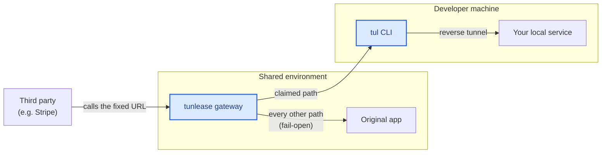

#  Tunlease

**Debug a webhook on your laptop using its real, unchangeable callback URL — no redeploy, no new URL.**

Claim one path on an existing fixed endpoint; its live traffic reaches your
laptop while every other path keeps serving the real app. Ctrl+C to release.

```bash
tul claim '/demo/testing/my-first-tunnel/' -p 8080 -g tunlease-relay.dotw.me
```


Similar in spirit to [ngrok](https://ngrok.com/),
[localtunnel](https://github.com/localtunnel/localtunnel), and
[bore](https://github.com/ekzhang/bore), Tunlease solves a different problem:
it keeps the callback URL already in use and temporarily redirects only the
path you claim.

[Developer quick start](#quick-start-for-developers) · [Self-hosting](docs/self-hosting.md) · [Architecture](docs/architecture.md) · [Troubleshooting](docs/developer-guide.md#troubleshooting)

[English](README.md) · [繁體中文](README.zh-TW.md)

## How it works



The gateway receives the fixed host's traffic and forks by path: a **claimed**
path with a connected tunnel reaches your laptop; every other path is proxied
to the configured original app. Blue nodes are Tunlease's; the rest already
exist.

The safety model combines a path allowlist, exclusive connected tunnels,
optional token authentication, audit logs, and origin fallback. Fallback
covers requests that have no matching connected session before dispatch.
Gateway, Ingress, and origin outages require separate infrastructure or bypass
planning. See the [routing and failure contract](docs/architecture.md#routing-and-failure-contract).

## Quick start for developers

Once your platform team gives you the gateway host, an allowed path, and an
optional token, install the CLI:

```bash
brew install iml885203/tap/tunlease
```

On Windows, install with Scoop:

```powershell
scoop bucket add tunlease https://github.com/iml885203/scoop-bucket
scoop install tunlease
```

Or install the latest verified binary directly:

```bash
# macOS and Linux
curl -fsSL https://raw.githubusercontent.com/iml885203/tunlease/main/scripts/install.sh | bash
```

```powershell
# Windows PowerShell (amd64)
irm https://raw.githubusercontent.com/iml885203/tunlease/main/scripts/install.ps1 | iex
```

Then claim the callback path:

```bash
tul claim '/demo/testing/my-first-tunnel/' -p 8080 -g tunlease-relay.dotw.me
```

Ctrl+C releases it. To use your own fixed callback host instead of the public
demo, see [Self-hosting Tunlease](docs/self-hosting.md).

Use the public demo only with test traffic. Claims on your own staging gateway
receive real callbacks, including their data and credentials. Start your local
service first, claim the narrowest path you need, and make callback handling
idempotent: provider retries and mid-request tunnel failures can produce
duplicate delivery.

See the [developer guide](docs/developer-guide.md) for configuration, lifecycle
commands, `--output json` automation, and troubleshooting. The installers
verify the published SHA-256 checksum before replacing the binary.

## Documentation

Choose the shortest path for your role:

- **Developer receiving callbacks or integrating a provider:** [Developer guide](docs/developer-guide.md) — installation, provider security, configuration, CLI usage, and troubleshooting ([繁中](docs/developer-guide.zh-TW.md))
- **Self-hosting Tunlease:** [Deployment guide](docs/self-hosting.md) — gateway setup, routing, Helm, rollout, and security ([繁中](docs/self-hosting.zh-TW.md))
- **Contributor understanding the system:** [Architecture](docs/architecture.md) — control/data planes, routing, lifecycle, and recovery ([繁中](docs/architecture.zh-TW.md))
- **Go application author:** [Embedding the Go client](docs/go-client.md) — module setup, lifecycle API, errors, and testing ([繁中](docs/go-client.zh-TW.md))

## Contributing

Contributions are welcome — see [CONTRIBUTING.md](CONTRIBUTING.md) for the local
setup and the `make preflight` quality gate. Please report security issues
privately per [SECURITY.md](SECURITY.md). Participation is governed by the
[Code of Conduct](CODE_OF_CONDUCT.md).

## License

[MIT](LICENSE)
