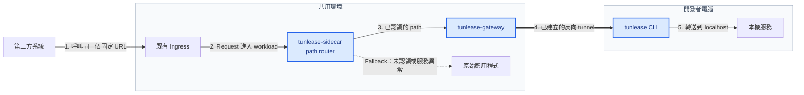

#  Tunlease

把第三方固定 endpoint 的特定 path，暫時轉送到開發者本機；第三方不需要更換 URL。

<!-- Demo GIF 待重錄。用 `vhs assets/demo.tape` 產生後再補回： -->
_Demo：claim 前 staging callback URL 回 404，`tunlease claim` 後同一 URL 打到本機服務，release 後又回 404。_

[開發者快速上手](#開發者快速上手) · [平台部署](docs/platform-deployment.zh-TW.md) · [架構](docs/architecture.zh-TW.md) · [疑難排解](docs/developer-guide.zh-TW.md#疑難排解)

[English](README.md) · [繁體中文](README.zh-TW.md)



第三方始終呼叫同一個 URL。開發者認領 path 後，只有該 path 會沿編號路徑進入 localhost；其他流量仍由原始應用程式處理。藍色節點是 Tunlease 擁有並發布的元件；其他節點都是環境中原本就存在的系統。

安全模型包含 path allowlist、互斥且有 TTL 的租約、可選的 token 認證、audit log，以及 fail-open routing。開發工具失效時，流量會回到原始應用程式，不影響既有 endpoint 的可用性。

## 開發者快速上手

這段流程假設平台端已完成以下準備：

- `tunlease-gateway` 已部署，且你的電腦可以連線。
- 固定 endpoint 的 workload 已加入 `tunlease-sidecar`。
- Gateway allowlist 包含你要認領的 path。

若缺少任何一項，請先看[平台部署指南](docs/platform-deployment.zh-TW.md)。

```bash
# macOS 與 Linux
curl -fsSL https://tunlease.example.com/install/install.sh | bash
```

```powershell
# Windows PowerShell（amd64）
irm https://tunlease.example.com/install/install.ps1 | iex
```

把 CLI 指向 gateway。不需要 token——staging gateway 未啟用 client 認證：

```bash
# macOS 與 Linux
cat > ~/.tunlease.yaml <<'YAML'
gateway: https://tunlease.example.com
YAML
chmod 600 ~/.tunlease.yaml
```

```powershell
# Windows PowerShell
@"
gateway: https://tunlease.example.com
"@ | Set-Content (Join-Path $HOME ".tunlease.yaml")
```

若維護者告知 gateway 需要認證，再在 `~/.tunlease.yaml` 加一行
`token: YOUR_PERSONAL_TOKEN`。先啟動本機服務，再認領最小範圍的 path：

```bash
# 把這個 path 與其子路徑轉到 localhost:8080；Ctrl+C 會釋放租約。
tunlease claim --to 8080 /webhooks/provider/callback/*
```

Claim 之後，真正的 staging 第三方 callback 會進到你的本機，所以請先確認本機服務已啟動、並認領最小範圍的 path。

常用指令：

```bash
tunlease list
tunlease list --all
tunlease release /webhooks/provider/callback/*
tunlease release --to 8080
tunlease update
tunlease --version
```

完整用法與問題排查請看[開發者指南](docs/developer-guide.zh-TW.md)。

Windows amd64 使用 Tunlease 專用的 tunnel transport，已通過公司裝置上的 endpoint-security 落地與執行檢查。PowerShell installer 會驗證發布的 SHA-256 checksum，並把上一版保留為 `tunlease.exe.prev`。

## 元件與部署模型

| 元件 | 位置 | 職責 |
|---|---|---|
| `tunlease` | 開發者電腦 | Claim、release、反向 tunnel 與 heartbeat |
| `tunlease-gateway` | 共用環境 | API、租約 registry 與反向 tunnel server |
| `tunlease-sidecar` | 固定 endpoint workload | 依 path 分流；任何失敗都回到原始 app |

這三個 binary 都不會呼叫 Kubernetes API，因此 Kubernetes 不是架構上的必要條件。不過 Kubernetes 是目前建議的部署方式：用 Helm 部署 gateway，再以 sidecar patch 把 proxy 加進目標 workload。

## 嵌入 tunnel client

Go 應用程式可以直接嵌入獨立 CLI 使用的同一套 claim、lease、重新連線與 tunnel engine，應用程式的使用者不需要另外安裝 `tunlease` binary。

```bash
go get github.com/iml885203/tunlease/pkg/tunnelclient@latest
```

認證方式、完整 lifecycle 範例、API 行為、錯誤處理、升級與整合測試請看[嵌入 Go client](docs/go-client.zh-TW.md)。

## 本機開發

需要 Go 與 Docker Compose；只有驗證部署 manifest 時才需要 Helm 和 kubectl。

```bash
make build      # 建置三個 binary 到 bin/
make test       # 執行 Go tests
make lint       # 執行固定版本的 golangci-lint container
make preflight  # build、vet、race test、lint 與格式檢查
make e2e        # Redis + gateway + sidecar + app + 真實 CLI
```

## 依角色閱讀

- **第一次導入 Tunlease 的團隊：**[導入指南](docs/adoption-guide.zh-TW.md)——從適用情境、image、部署、開發者 claim 到完整流程驗證（[English](docs/adoption-guide.md)）
- **要接第三方 callback 的開發者：**[開發者指南](docs/developer-guide.zh-TW.md)——安裝、設定、CLI 與疑難排解（[English](docs/developer-guide.md)）
- **要自架 gateway 的平台團隊：**[平台部署指南 → 安裝 Gateway](docs/platform-deployment.zh-TW.md#安裝-gateway)——自架前提（image、Ingress、DNS/TLS）、Helm 安裝與安全（[English](docs/platform-deployment.md#install-the-gateway)）
- **要加 sidecar 的 service owner：**[平台部署指南 → 加入 Sidecar](docs/platform-deployment.zh-TW.md#加入-sidecar)——patch workload、sidecar env 與共用的 route-table token（[English](docs/platform-deployment.md#add-the-sidecar)）
- **要理解或修改系統的貢獻者：**[架構](docs/architecture.zh-TW.md)——control/data plane、routing 與復原流程（[English](docs/architecture.md)）
- **要實作 client 或 protocol 的開發者：**[v1 protocol 規格](docs/spec-v1.zh-TW.md)——HTTP/tunnel contract 與設計邊界（[English](docs/spec-v1.md)）
- **要在 Go 應用程式嵌入 tunnel 的開發者：**[嵌入 Go client](docs/go-client.zh-TW.md)——module 設定、lifecycle API、錯誤與測試（[English](docs/go-client.md)）

## 目前狀態

v0.1 產品 baseline 已完成。Gateway、CLI、可重用 Go client 與 sidecar 皆可運作：public endpoint → localhost tunnel、10 分鐘 idle tunnel timeout、fail-open、in-memory 與可選的 Redis registry、安裝與自動更新，以及跨平台（Linux/macOS/Windows）binary 都已具備。

單一 gateway replica 搭配 memory registry 是一種有效的部署方式。Gateway 重啟時，claim 會短暫消失，流量先 fail-open 回原始 app；CLI 接著自動重新 claim 並建立 tunnel。只有在真的需要持久租約或多 replica 時，才需要啟用 Redis。

## 參與貢獻

歡迎貢獻——本機設定與 `make preflight` 品質檢查請看 [CONTRIBUTING.md](CONTRIBUTING.md)。
安全性問題請依 [SECURITY.md](SECURITY.md) 私下回報。社群互動遵循
[行為準則](CODE_OF_CONDUCT.md)。

## 授權

[MIT](LICENSE)
