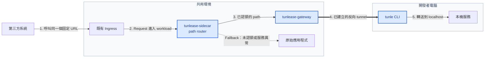

#  Tunlease

把第三方固定 endpoint 的特定 path，暫時轉送到開發者本機；第三方不需要更換 URL。


[開發者快速上手](#開發者快速上手) · [平台部署](docs/platform-deployment.zh-TW.md) · [架構](docs/architecture.zh-TW.md) · [疑難排解](docs/developer-guide.zh-TW.md#疑難排解)

[English](README.md) · [繁體中文](README.zh-TW.md)



第三方始終呼叫同一個 URL。開發者認領 path 後，只有該 path 會沿編號路徑進入 localhost；其他流量仍由原始應用程式處理。藍色節點是 Tunlease 擁有並發布的元件；其他節點都是環境中原本就存在的系統。

安全模型包含 path allowlist、互斥且有 TTL 的租約、可選的 token 認證、audit log，以及 fail-open routing。開發工具失效時，流量會回到原始應用程式，不影響既有 endpoint 的可用性。

## 與其他工具的比較

精神上類似 [ngrok](https://ngrok.com/)、
[localtunnel](https://github.com/localtunnel/localtunnel)、
[bore](https://github.com/ekzhang/bore)——但解決的問題不同。那些工具是給你的本機 port
一個**新的** URL；Tunlease 保留第三方**既有的固定** URL，只把其中一條 path 轉到你的機器。

| | Tunlease | ngrok | localtunnel | bore |
|---|:---:|:---:|:---:|:---:|
| 對外暴露本機 port | ✅ | ✅ | ✅ | ✅ |
| 保留第三方既有的固定 URL | ✅ | ❌ | ❌ | ❌ |
| 只 claim 一條 path，其餘不動 | ✅ | ❌ | ❌ | ❌ |
| Fail-open 回真正的 app | ✅ | ❌ | ❌ | ❌ |
| 互斥租約、多開發者共用一個 URL | ✅ | ❌ | ❌ | ❌ |
| 可自架 | ✅ | ❌ | ✅ | ✅ |
| 零 server 設定即可用 | ❌ | ✅ | ✅ | ✅ |

Tunlease 需要先在固定 endpoint 前面放一個 gateway（這是保留既有 URL 的代價）；
ngrok/localtunnel/bore 只需要它們自己的 relay，不用額外部署。

## 開發者快速上手

平台團隊部署好 gateway、你也拿到它的 URL 之後，開發者只需要兩個命令：安裝、再
claim。若 gateway 還沒架好，請先看[平台部署指南](docs/platform-deployment.zh-TW.md)。

```bash
# macOS 與 Linux
curl -fsSL https://tunlease.example.com/install/install.sh | bash
```

```powershell
# Windows PowerShell（amd64）
irm https://tunlease.example.com/install/install.ps1 | iex
```

接著用一行命令認領 path——用 `--gateway` 指向 gateway，用 `--to` 把 path 轉到本機
port。Ctrl+C 釋放租約。

```bash
tunle claim /webhooks/provider/callback/* --to 8080 --gateway https://tunlease.example.com
```

Claim 之後真正的 staging 第三方 callback 會進到你的本機，所以請先啟動本機服務、
並認領最小範圍的 path。

若不想每次重打 `--gateway`，設成環境變數一次即可：

```bash
export TUNLEASE_GATEWAY=https://tunlease.example.com
tunle claim /webhooks/provider/callback/* --to 8080
```

或者，若偏好用檔案，放進 `~/.tunlease.yaml`（gateway 需要認證時，`token:` 也寫這裡）：

```yaml
gateway: https://tunlease.example.com
```

其餘指令都用同樣的簡短形式：

```bash
tunle list                                    # 你目前的 claim
tunle list --all                              # gateway 上所有 claim
tunle release /webhooks/provider/callback/*   # 釋放某個 path
tunle release --to 8080                        # 釋放某個 port 上的全部
tunle update                                  # 自我更新 binary
tunle --version
```

完整用法與問題排查請看[開發者指南](docs/developer-guide.zh-TW.md)。

Windows amd64 使用 Tunlease 專用的 tunnel transport。PowerShell installer 會驗證發布的 SHA-256 checksum，並把上一版保留為 `tunle.exe.prev`。

## 元件與部署模型

全部都是同一個 `tunle` binary，用 subcommand 切換角色：

| 命令 | 執行於 | 職責 |
|---|---|---|
| `tunle claim`（及 `list` / `release`） | 開發者電腦 | Claim 一條 path、持有租約、反向 tunnel、heartbeat |
| `tunle gateway` | 共用環境 | API、租約 registry 與反向 tunnel server |
| `tunle sidecar` | 固定 endpoint workload | 依 path 分流；任何失敗都回到原始 app |
| `tunle serve` | 單機、前置單一 app | Gateway **與** router 同一個 process |

Server 端有兩種跑法：

- **單機、單一 app** — 跑 `tunle serve --app http://localhost:3000`。一個 process
  前置該 app：被 claim 的 path tunnel 給開發者，其餘一律 fail-open 回 app。不需要
  gateway/sidecar 拆分，也不需要 Kubernetes。
- **共用平台、多個 app** — 跑一次 `tunle gateway`，再在每個固定 endpoint 的
  workload 旁加 `tunle sidecar`。這是 Helm chart 與 sidecar patch 部署的模型。

這些都不會呼叫 Kubernetes API，因此 Kubernetes 不是必要條件——它只是多-app 模型的建議部署目標。

## 嵌入 tunnel client

Go 應用程式可以直接嵌入獨立 CLI 使用的同一套 claim、lease、重新連線與 tunnel engine，應用程式的使用者不需要另外安裝 `tunle` binary。

```bash
go get github.com/iml885203/tunlease/pkg/tunnelclient@latest
```

認證方式、完整 lifecycle 範例、API 行為、錯誤處理、升級與整合測試請看[嵌入 Go client](docs/go-client.zh-TW.md)。

## 本機開發

需要 Go 與 Docker Compose；只有驗證部署 manifest 時才需要 Helm 和 kubectl。

```bash
make build      # 建置三個 binary 到 bin/
make test       # 執行 Go tests
make lint       # 執行固定版本的 golangci-lint container
make preflight  # build、vet、race test、lint 與格式檢查
make e2e        # Redis + gateway + sidecar + app + 真實 CLI
```

## 依角色閱讀

- **第一次導入 Tunlease 的團隊：**[導入指南](docs/adoption-guide.zh-TW.md)——從適用情境、image、部署、開發者 claim 到完整流程驗證（[English](docs/adoption-guide.md)）
- **要接第三方 callback 的開發者：**[開發者指南](docs/developer-guide.zh-TW.md)——安裝、設定、CLI 與疑難排解（[English](docs/developer-guide.md)）
- **要自架 gateway 的平台團隊：**[平台部署指南 → 安裝 Gateway](docs/platform-deployment.zh-TW.md#安裝-gateway)——自架前提（image、Ingress、DNS/TLS）、Helm 安裝與安全（[English](docs/platform-deployment.md#install-the-gateway)）
- **要加 sidecar 的 service owner：**[平台部署指南 → 加入 Sidecar](docs/platform-deployment.zh-TW.md#加入-sidecar)——patch workload、sidecar env 與共用的 route-table token（[English](docs/platform-deployment.md#add-the-sidecar)）
- **要理解或修改系統的貢獻者：**[架構](docs/architecture.zh-TW.md)——control/data plane、routing 與復原流程（[English](docs/architecture.md)）
- **要實作 client 或 protocol 的開發者：**[v1 protocol 規格](docs/spec-v1.zh-TW.md)——HTTP/tunnel contract 與設計邊界（[English](docs/spec-v1.md)）
- **要在 Go 應用程式嵌入 tunnel 的開發者：**[嵌入 Go client](docs/go-client.zh-TW.md)——module 設定、lifecycle API、錯誤與測試（[English](docs/go-client.md)）

## 目前狀態

v0.1 產品 baseline 已完成。Gateway、CLI、可重用 Go client 與 sidecar 皆可運作：public endpoint → localhost tunnel、10 分鐘 idle tunnel timeout、fail-open、in-memory 與可選的 Redis registry、安裝與自動更新，以及跨平台（Linux/macOS/Windows）binary 都已具備。

單一 gateway replica 搭配 memory registry 是一種有效的部署方式。Gateway 重啟時，claim 會短暫消失，流量先 fail-open 回原始 app；CLI 接著自動重新 claim 並建立 tunnel。只有在真的需要持久租約或多 replica 時，才需要啟用 Redis。

## 參與貢獻

歡迎貢獻——本機設定與 `make preflight` 品質檢查請看 [CONTRIBUTING.md](CONTRIBUTING.md)。
安全性問題請依 [SECURITY.md](SECURITY.md) 私下回報。社群互動遵循
[行為準則](CODE_OF_CONDUCT.md)。

## 授權

[MIT](LICENSE)
