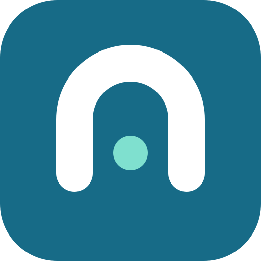

#  Tunlease

**在自己電腦上 debug webhook，用它真實、改不了的 callback URL——不重新部署、不換新 URL。**

在既有的固定 endpoint 上認領一條 path，它的即時流量就進到你的電腦，而其他 path
照常打到真正的 app。Ctrl+C 釋放。

```bash
tunle claim /webhooks/stripe/* --to 8080 --gateway staging.myapp.com
```


跟 ngrok/localtunnel/bore 不同，它**不會**給你一個新 URL。[與其他工具的比較](#與其他工具的比較)。

[核心概念與 URL 對照](docs/concepts.zh-TW.md) · [任務索引](docs/tasks.zh-TW.md) · [開發者快速上手](#開發者快速上手) · [平台部署](docs/platform-deployment.zh-TW.md) · [疑難排解](docs/developer-guide.zh-TW.md#疑難排解)

[English](README.md) · [繁體中文](README.zh-TW.md)

## 運作方式


Gateway 接收固定 host 的流量並依 path 分流：**已認領**且 tunnel 已連線的 path
到達你的電腦；其他 path proxy 到設定的原 app。藍色節點是 Tunlease 的；其餘本來就存在。

安全模型包含 path allowlist、互斥且有 TTL 的租約、可選 token 認證、audit log 與
fail-open routing。Fail-open 涵蓋 gateway 健康時未符合的 path 與無法使用的 developer
tunnel；gateway 本身的 availability 仍需一般平台 HA 或 bypass 規劃。詳見
[routing 與失敗契約](docs/concepts.zh-TW.md#routing-與失敗契約)。

## 與其他工具的比較

精神上類似 [ngrok](https://ngrok.com/)、
[localtunnel](https://github.com/localtunnel/localtunnel)、
[bore](https://github.com/ekzhang/bore)——但解決的問題不同。那些工具是給你的本機 port
一個**新的** URL；Tunlease 保留第三方**既有的固定** URL，只把其中一條 path 轉到你的機器。

| | Tunlease | ngrok | localtunnel | bore |
|---|:---:|:---:|:---:|:---:|
| 對外暴露本機 port | ✅ | ✅ | ✅ | ✅ |
| 保留第三方既有的固定 URL | ✅ | ❌ | ❌ | ❌ |
| 只 claim 一條 path，其餘不動 | ✅ | ❌ | ❌ | ❌ |
| Fail-open 回真正的 app | ✅ | ❌ | ❌ | ❌ |
| 互斥租約、多開發者共用一個 URL | ✅ | ❌ | ❌ | ❌ |
| 可自架 | ✅ | ❌ | ✅ | ✅ |

## 開發者快速上手

平台團隊把既有 callback host 導入 gateway，並提供 URL、允許的 prefix 與可選 token
後，安裝 CLI 再 claim。若 gateway 還沒架好，請先看
[平台部署指南](docs/platform-deployment.zh-TW.md)。

```bash
# macOS 與 Linux
# 請把 YOUR_TUNLEASE_HOST 換成團隊發布 installer 的 host。
curl -fsSL https://YOUR_TUNLEASE_HOST/install/install.sh | bash
```

```powershell
# Windows PowerShell（amd64）
# 請把 YOUR_TUNLEASE_HOST 換成團隊發布 installer 的 host。
irm https://YOUR_TUNLEASE_HOST/install/install.ps1 | iex
```

接著用一行命令認領 path——用 `--gateway` 指向 gateway（就填平台團隊給你的網域），
用 `--to` 把 path 轉到本機 port。Ctrl+C 釋放租約。scheme 預設為 `https`，可以省略；
若 gateway 沒有 TLS（例如 localhost）就明確加上 `http://`。control plane 的路徑前綴由
client 自動附加，所以不用自己在網址裡加 `/_tunlease`。

```bash
tunle claim /webhooks/provider/callback/* --to 8080 --gateway myapp.example.com
```

Claim 會收到真實 staging callback，包含其中的資料與 credential。請先啟動本機服務、
只 claim 所需的最窄 path，並確保 callback handler idempotent：provider retry
與 request 中途 tunnel failure 都可能造成重複 delivery。

若不想每次重打 `--gateway`，設成環境變數一次即可：

```bash
export TUNLEASE_GATEWAY=myapp.example.com
tunle claim /webhooks/provider/callback/* --to 8080
```

或者，若偏好用檔案，放進 `~/.tunlease.yaml`（gateway 需要認證時，`token:` 也寫這裡）：

```yaml
gateway: myapp.example.com
```

其餘指令都用同樣的簡短形式：

```bash
tunle list                                    # 你目前的 claim
tunle list --all                              # gateway 上所有 claim
tunle release /webhooks/provider/callback/*   # 釋放某個 path
tunle release --to 8080                        # 釋放某個 port 上的全部
tunle update                                  # 自我更新 binary
tunle --version
```

完整用法與問題排查請看[開發者指南](docs/developer-guide.zh-TW.md)。

Windows amd64 使用 Tunlease 專用的 tunnel transport。PowerShell installer 會驗證發布的 SHA-256 checksum，並把上一版保留為 `tunle.exe.prev`。

## 元件與部署模型

全部都是同一個 `tunle` binary，用 subcommand 切換角色：

| 命令 | 執行於 | 職責 |
|---|---|---|
| `tunle claim`（及 `list` / `release`） | 開發者電腦 | Claim 一條 path、持有租約、反向 tunnel、heartbeat |
| `tunle gateway` | 前置於 app | API、租約 registry、反向 tunnel server、path 分流與 fail-open 回 app |
| `tunle serve` | 單機、前置單一 app | `gateway` 的便利包裝，把 `fail_open_url` 設為 `--app` |

Gateway 位於 app 前面，並包辦 server 端所有事情。它把 control plane 放在
`control_prefix`（預設 `/_tunlease`）底下；其餘 path 都是第三方流量——符合 claim
時 tunnel 給開發者，否則 proxy 回 `fail_open_url`（原始 app），再否則 404。
沒有獨立的 sidecar process。

- **單機、單一 app** — 跑 `tunle serve --app http://localhost:3000`。一個 process
  前置該 app：被 claim 的 path tunnel 給開發者，其餘一律 fail-open 回 app。不需要
  Kubernetes。
- **共用平台** — 跑 `tunle gateway`，把 `fail_open_url` 指向 app 的 Service，並將
  gateway 部署在 app 前面（Ingress → gateway）。這是 Helm chart 部署的模型。

Gateway 不會呼叫 Kubernetes API，因此 Kubernetes 不是必要條件——它只是平台模型的建議部署目標。

## 嵌入 tunnel client

Go 應用程式可以直接嵌入獨立 CLI 使用的同一套 claim、lease、重新連線與 tunnel engine，應用程式的使用者不需要另外安裝 `tunle` binary。

```bash
go get github.com/iml885203/tunlease/pkg/tunnelclient@latest
```

認證方式、完整 lifecycle 範例、API 行為、錯誤處理、升級與整合測試請看[嵌入 Go client](docs/go-client.zh-TW.md)。

## 本機開發

需要 Go 與 Docker Compose；只有驗證部署 manifest 時才需要 Helm 和 kubectl。

```bash
make build      # 建置 tunle binary 到 bin/
make test       # 執行 Go tests
make lint       # 執行固定版本的 golangci-lint container
make preflight  # build、vet、race test、lint 與格式檢查
make e2e        # Redis + gateway + app + 真實 CLI
```

## 依角色閱讀

- **任何需要理解模型的人：**[核心概念與 URL 對照](docs/concepts.zh-TW.md)——canonical topology、詞彙、routing/failure matrix、HTTP trust boundary 與部署限制（[English](docs/concepts.md)）
- **第一次導入 Tunlease 的團隊：**[導入指南](docs/adoption-guide.zh-TW.md)——從適用情境、image、部署、開發者 claim 到完整流程驗證（[English](docs/adoption-guide.md)）
- **要接第三方 callback 的開發者：**[開發者指南](docs/developer-guide.zh-TW.md)——安裝、設定、CLI 與疑難排解（[English](docs/developer-guide.md)）
- **要自架 gateway 的平台團隊：**[平台部署指南 → 安裝 Gateway](docs/platform-deployment.zh-TW.md#安裝-gateway)——自架前提（image、Ingress、DNS/TLS）、Helm 安裝與安全（[English](docs/platform-deployment.md#install-the-gateway)）
- **要前置 app 的 service owner：**[平台部署指南 → 用 Gateway 前置 App](docs/platform-deployment.zh-TW.md#用-gateway-前置-app)——把 gateway 部署在 app 前面，並將 `fail_open_url` 指向 app 的 Service（[English](docs/platform-deployment.md#front-the-app-with-the-gateway)）
- **要理解或修改系統的貢獻者：**[架構](docs/architecture.zh-TW.md)——control/data plane、routing 與復原流程（[English](docs/architecture.md)）
- **要在 Go 應用程式嵌入 tunnel 的開發者：**[嵌入 Go client](docs/go-client.zh-TW.md)——module 設定、lifecycle API、錯誤與測試（[English](docs/go-client.md)）

## 目前狀態

v0.1 產品 baseline 已完成。Gateway、CLI 與可重用 Go client 皆可運作：public endpoint → localhost tunnel、fail-open、in-memory 與可選的 Redis registry、安裝與自動更新，以及跨平台（Linux/macOS/Windows）binary 都已具備。

單一 gateway replica 搭配 memory registry 是目前支援的 data-plane 部署。
Gateway 重啟會清掉 lease；gateway 恢復可連線後，CLI 會重新 claim 並重建 tunnel。
Redis 可保留 lease record，但 tunnel session 仍在單一 process，因此只有 Redis
並不能安全支援多 gateway replica。

## 參與貢獻

歡迎貢獻——本機設定與 `make preflight` 品質檢查請看 [CONTRIBUTING.md](CONTRIBUTING.md)。
安全性問題請依 [SECURITY.md](SECURITY.md) 私下回報。社群互動遵循
[行為準則](CODE_OF_CONDUCT.md)。

## 授權

[MIT](LICENSE)
