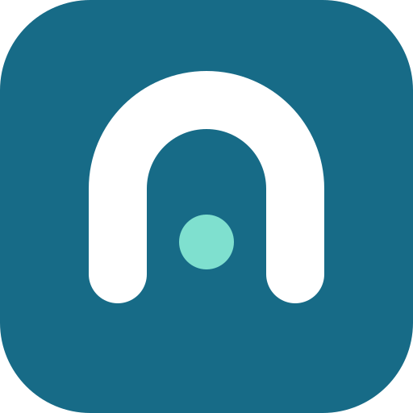
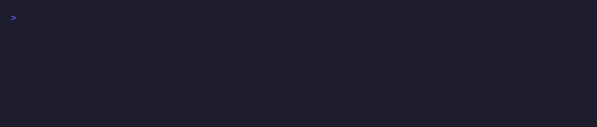
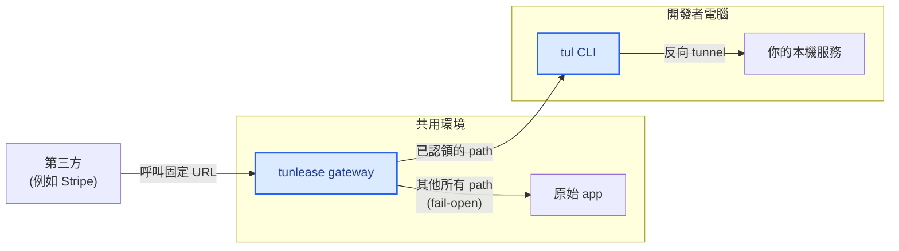

#  Tunlease

**在自己電腦上 debug webhook，用它真實、改不了的 callback URL——不重新部署、不換新 URL。**

在既有的固定 endpoint 上認領一條 path，它的即時流量就進到你的電腦，而其他 path
照常打到真正的 app。Ctrl+C 釋放。

```bash
tul claim '/demo/testing/my-first-tunnel/' --to 8080 --gateway tunlease.dotw.me
```



概念上類似 [ngrok](https://ngrok.com/)、
[localtunnel](https://github.com/localtunnel/localtunnel) 與
[bore](https://github.com/ekzhang/bore)，但 Tunlease 解決的問題不同：它保留已經
在使用的 callback URL，只暫時轉送你 claim 的 path。

[開發者快速上手](#開發者快速上手) · [自行架設](docs/self-hosting.zh-TW.md) · [架構](docs/architecture.zh-TW.md) · [疑難排解](docs/developer-guide.zh-TW.md#疑難排解)

[English](README.md) · [繁體中文](README.zh-TW.md)

## 運作方式



Gateway 接收固定 host 的流量並依 path 分流：**已認領**且 tunnel 已連線的 path
到達你的電腦；其他 path proxy 到設定的原 app。藍色節點是 Tunlease 的；其餘本來就存在。

安全模型包含 path allowlist、互斥的 connected tunnel、可選 token 認證、audit log 與
origin fallback。Fallback 只涵蓋 dispatch 前沒有 matching connected session 的 request。
Gateway、Ingress 與 origin outage 需另外規劃 infrastructure 或 bypass。詳見
[路由與失敗契約](docs/architecture.zh-TW.md#路由與失敗契約)。

## 開發者快速上手

平台團隊提供 gateway host、允許的 path 與可選 token 後，安裝 CLI：

```bash
brew install iml885203/tap/tunlease
```

Windows 使用 Scoop 安裝：

```powershell
scoop bucket add tunlease https://github.com/iml885203/scoop-bucket
scoop install tunlease
```

也可直接安裝最新且經過驗證的 binary：

```bash
# macOS 與 Linux
curl -fsSL https://raw.githubusercontent.com/iml885203/tunlease/main/scripts/install.sh | bash
```

```powershell
# Windows PowerShell（amd64）
irm https://raw.githubusercontent.com/iml885203/tunlease/main/scripts/install.ps1 | iex
```

接著 claim callback path：

```bash
tul claim '/demo/testing/my-first-tunnel/' --to 8080 --gateway tunlease.dotw.me
```

Ctrl+C 釋放。若要使用自己的固定 callback host，而不是 public demo，請看
[自行架設 Tunlease](docs/self-hosting.zh-TW.md)。

Public demo 只能用於測試流量。自己 staging gateway 上的 claim 會收到真實
callback，包含其中的資料與 credential。請先啟動本機服務、只 claim 所需的
最窄 path，並確保 callback handler idempotent：provider retry 與 request
中途 tunnel failure 都可能造成重複 delivery。

設定、lifecycle 指令、`--output json` automation 與問題排查請看
[開發者指南](docs/developer-guide.zh-TW.md)。Installer 會在更換 binary 前
驗證發布的 SHA-256 checksum。

## 元件與部署模型

全部都是同一個 `tul` binary，用 subcommand 切換角色：

| 命令 | 執行於 | 職責 |
|---|---|---|
| `tul claim`（及 `list` / `release`） | 開發者電腦 | 把一條 path 連到本機服務 |
| `tul gateway` | 前置於 app | 管理 active path、終止 tunnel、路由 request 並 proxy 到原 app |

Gateway 位於 app 前面，並包辦 server 端所有事情。它把 control plane 放在
固定的 `/_tunlease` 底下；其餘 path 都是第三方流量——符合 claim
時 tunnel 給開發者，否則 proxy 回 `fail_open_url`（原始 app）；沒有原始 app
的 public demo relay 也可以改回設定的固定錯誤。沒有獨立的 sidecar process。

- **任何環境、單一 app origin** — 跑 `tul gateway`，把 `fail_open_url` 指向 app 的 Service，並將
  gateway 部署在 app 前面（Ingress → gateway）。這是 Helm chart 部署的模型。

Gateway 不會呼叫 Kubernetes API，因此 Kubernetes 不是必要條件——它只是平台模型的建議部署目標。

## 嵌入 tunnel client

Go 應用程式可以直接嵌入相同的 path ownership、重新連線與 tunnel engine，使用者不需要另外安裝 `tul` binary。

```bash
go get github.com/iml885203/tunlease/pkg/tunnelclient@latest
```

認證方式、完整 lifecycle 範例、API 行為、錯誤處理、升級與整合測試請看[嵌入 Go client](docs/go-client.zh-TW.md)。

## 本機開發

需要 Go 與 Docker Compose；只有驗證部署 manifest 時才需要 Helm 和 kubectl。

每個 clone 執行一次，啟用 formatting、vet 與 lint pre-commit hook：

```bash
make hooks
```

```bash
make build      # 建置 tul binary 到 bin/
make test       # 執行 Go tests
make lint       # 由 Go 下載並執行與 CI 相同的固定版 golangci-lint
make preflight  # build、vet、race test、lint 與格式檢查
make e2e        # gateway + origin app + local app + 真實 CLI
```

## 依角色閱讀

- **要接第三方 callback 或整合 provider 的開發者：**[開發者指南](docs/developer-guide.zh-TW.md)——安裝、provider security、設定、CLI 與疑難排解（[English](docs/developer-guide.md)）
- **自行架設 Tunlease：**[部署指南](docs/self-hosting.zh-TW.md)——gateway 設定、routing、Helm、rollout 與安全（[English](docs/self-hosting.md)）
- **要理解或修改系統的貢獻者：**[架構](docs/architecture.zh-TW.md)——control/data plane、routing 與復原流程（[English](docs/architecture.md)）
- **要在 Go 應用程式嵌入 tunnel 的開發者：**[嵌入 Go client](docs/go-client.zh-TW.md)——module 設定、lifecycle API、錯誤與測試（[English](docs/go-client.md)）

## 目前狀態

Gateway、CLI 與可重用 Go client 皆可運作。目前刻意只支援單一 gateway
replica：active path 與 WebSocket session 在同一 process。Gateway 重啟會斷線；
恢復後，仍在執行的 client 會重新連線並登記 path。

## 參與貢獻

歡迎貢獻——本機設定與 `make preflight` 品質檢查請看 [CONTRIBUTING.md](CONTRIBUTING.md)。
安全性問題請依 [SECURITY.md](SECURITY.md) 私下回報。社群互動遵循
[行為準則](CODE_OF_CONDUCT.md)。

## 授權

[MIT](LICENSE)
