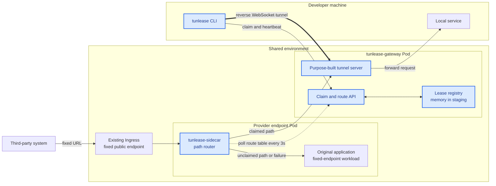
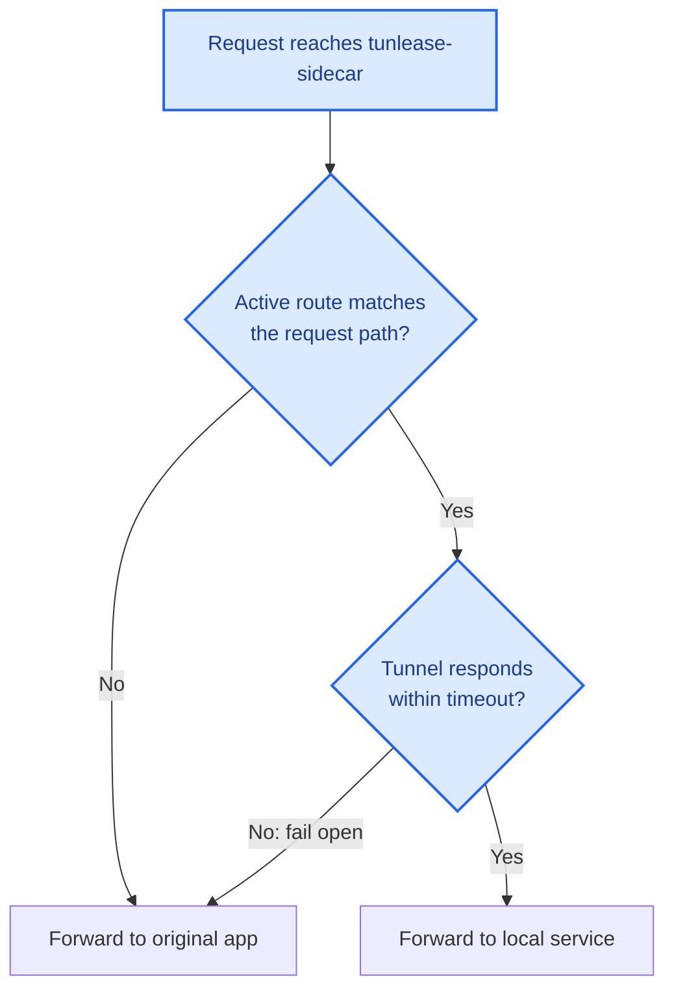
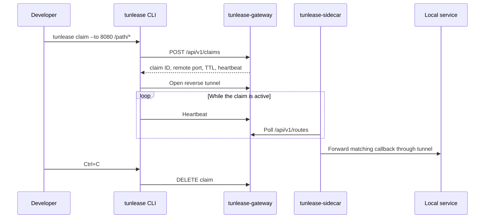

# Architecture

[English](architecture.md) · [繁體中文](architecture.zh-TW.md)

## System overview

Blue nodes are owned and shipped by tunlease; neutral nodes are third-party systems or existing infrastructure and applications. The control plane consists of claims, heartbeats, leases, and route-table polling. The data plane is the request path through the sidecar to either the original app or the reverse tunnel. The sidecar never depends on Kubernetes APIs.

## Request routing

The sidecar uses longest-prefix matching. If the route table is unavailable for more than its maximum stale period, it clears the table, making every request take the original-app path.

## Claim lifecycle

## Gateway Pod replacement

With the in-memory registry, replacing the gateway Pod removes all leases and tunnels. This is intentional for the current single-replica deployment:

1. The sidecar cannot reach the old tunnel and fails open to the original app.
2. The CLI reconnects, discovers that its lease no longer exists, and creates a new claim.
3. The CLI builds a new tunnel and the sidecar receives the new route.
4. Matching callbacks resume forwarding to the local service.

This behavior has been verified in a staging environment; callback forwarding recovered in approximately 17 seconds without returning gateway-generated 5xx responses.

## Deployment boundary

The core protocol does not require Kubernetes. Kubernetes provides the current packaging and lifecycle model:

- Helm deploys the shared gateway, Service, Ingress, and configuration Secret.
- The target application's version-controlled Deployment adds `tunlease-sidecar`.
- The sidecar takes the application's original Service port; the application moves to a Pod-local port.
- Public hosts, paths, and third-party configuration remain unchanged.
