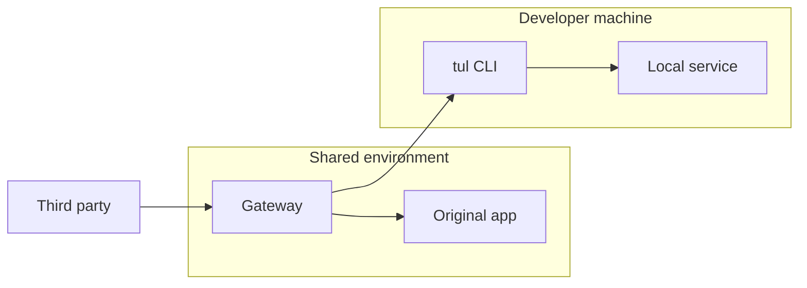

# Architecture

[English](architecture.md) · [繁體中文](architecture.zh-TW.md)

Tunlease has four concepts:

- **Gateway** — a whole-host proxy in front of one application.
- **Unclaimed target** — the original application configured by
  `fail_open_url`, or a fixed error configured by `unclaimed_status`.
- **Tunnel session** — one live WSS connection from a developer.
- **Claimed paths** — prefixes exclusively owned by that connection.

The WebSocket is the claim: a successful handshake owns the paths and closing
the connection releases them. Operators may additionally configure a maximum
claim duration; this is a bound on that live session, not a durable lease.

## Topology and URL map

The existing callback host routes `/` to the gateway. `/_tunlease` is reserved
for health, list/release, and the tunnel WebSocket. Every other path is data
traffic. When configured, the origin must use a separate internal URL that
cannot loop through the public gateway.

## Session lifecycle

`GET /_tunlease/tunnel` upgrades to WebSocket. Authentication, path validation,
exclusive ownership, tunnel creation, and readiness happen in that handshake.
The gateway and client exchange a bounded ready/ack handshake; incomplete
connections time out and release their paths. `Start` returns only after the
data channel is routable.

Network loss releases the server record. The client retries and sends its old
claim ID as replacement context; a successful reconnect receives a new ID.
Traffic goes to the origin during the gap. An explicit release is terminal and
must not reconnect: the gateway sends a release control frame and returns
success only after the client acknowledges it.

When `max_claim_duration` is configured, the handshake includes `expires_at`.
At that deadline the gateway sends a terminal expiry control frame, waits for
the client acknowledgement, closes the session, and releases the paths.

The remaining HTTP API is:

- `GET /_tunlease/api/v1/claims`
- `DELETE /_tunlease/api/v1/claims/{id}`
- `GET /_tunlease/healthz`

## Routing and failure contract

| State | Result |
|---|---|
| Path matches a connected session | Send through yamux to localhost |
| No matching connected session | Proxy to the origin, or return the configured error |
| Tunnel/local failure after dispatch starts | Return `502 This path is claimed, but its local service is unavailable.`; never replay |
| Dispatched tunnel has no read or write activity until `tunnel_idle_timeout` | Close that request and return `504`; never replay |
| Gateway or configured origin unavailable | Platform outage |

Paths must start with `/`. A path without a wildcard is exact; its trailing
slash is ignored, so `/callback` and `/callback/` are equivalent. A trailing
`/*` matches exactly one child segment, while `/**` matches the path itself and
all descendants at any depth. Wildcards are not supported elsewhere. Each path
is at most 512 bytes and one session may own at most 8 paths. Overlapping claim
scopes are exclusive. The gateway forwards HTTP method, path/query, headers,
body, and response; applications must still handle provider retries and
duplicate delivery.
After a proxied response completes, the gateway sends a best-effort activity
event to the owning client on a separate yamux stream. It contains only the
method, path without query, response status, and duration; activity reporting
does not block the response or inspect the tunneled HTTP stream.

## Deployment boundary

The supported v1 data plane is one gateway process with in-memory state.
Multiple replicas are unsafe because WebSocket sessions are process-local.
Gateway restart creates a reconnect gap; it does not preserve active claims.
Outer HTTPS/WSS provides transport security. There is no second TLS layer
inside the tunnel.
