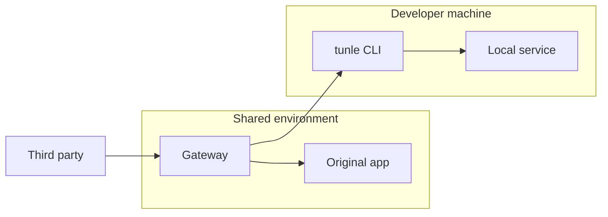

# Architecture

[English](architecture.md) · [繁體中文](architecture.zh-TW.md)

Tunlease has four concepts:

- **Gateway** — a whole-host proxy in front of one application.
- **Origin** — that original application, configured by `fail_open_url`.
- **Tunnel session** — one live WSS connection from a developer.
- **Claimed paths** — prefixes exclusively owned by that connection.

There is no independent lease. The WebSocket is the claim: a successful
handshake owns the paths and closing the connection releases them.

## Topology and URL map

The existing callback host routes `/` to the gateway. `/_tunlease` is reserved
for health, list/release, and the tunnel WebSocket. Every other path is data
traffic. The origin must use a separate internal URL that cannot loop through
the public gateway.

## Session lifecycle

`GET /_tunlease/tunnel` upgrades to WebSocket. Authentication, path validation,
exclusive ownership, tunnel creation, and readiness happen in that handshake.
The gateway and client exchange a bounded ready/ack handshake; incomplete
connections time out and release their paths. `Start` returns only after the
data channel is routable.

Network loss releases the server record. The client retries and sends its old
claim ID as replacement context; a successful reconnect receives a new ID.
Traffic goes to the origin during the gap. An explicit release is terminal and
must not reconnect: the gateway sends a release control frame and returns
success only after the client acknowledges it.

The remaining HTTP API is:

- `GET /_tunlease/api/v1/claims`
- `DELETE /_tunlease/api/v1/claims/{id}`
- `GET /_tunlease/healthz`

## Routing and failure contract

| State | Result |
|---|---|
| Path matches a connected session | Send through yamux to localhost |
| No matching connected session | Proxy to the origin |
| Tunnel/local failure after dispatch starts | Return an error; never replay |
| Gateway or origin unavailable | Platform outage |

Paths must start with `/`, end in `/*`, and not otherwise contain `*`.
Each path is at most 512 bytes and one session may own at most 8 paths.
Overlapping prefixes are exclusive. The gateway forwards HTTP method,
path/query, headers, body, and response; applications must still handle
provider retries and duplicate delivery.

## Deployment boundary

The supported v1 data plane is one gateway process with in-memory state.
Multiple replicas are unsafe because WebSocket sessions are process-local.
Gateway restart creates a reconnect gap; it does not preserve active claims.
Outer HTTPS/WSS provides transport security. There is no second TLS layer
inside the tunnel.
