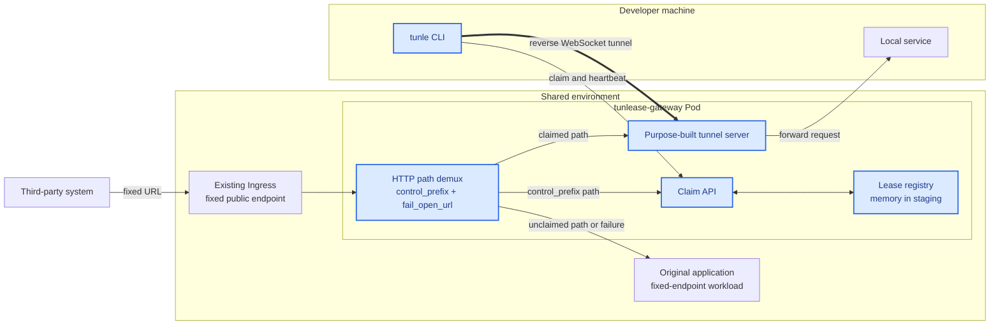
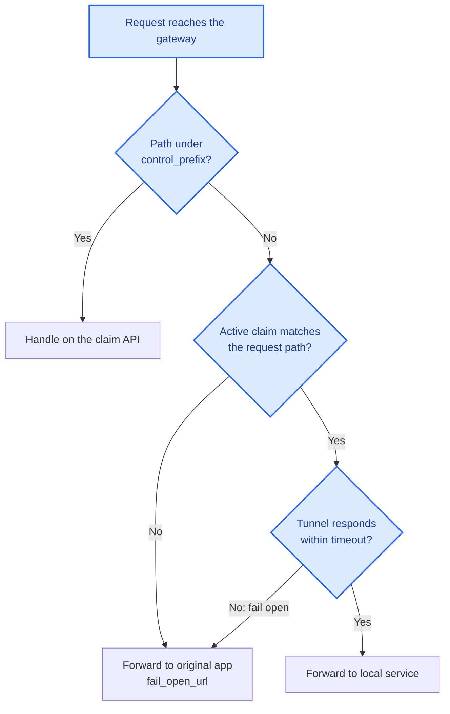
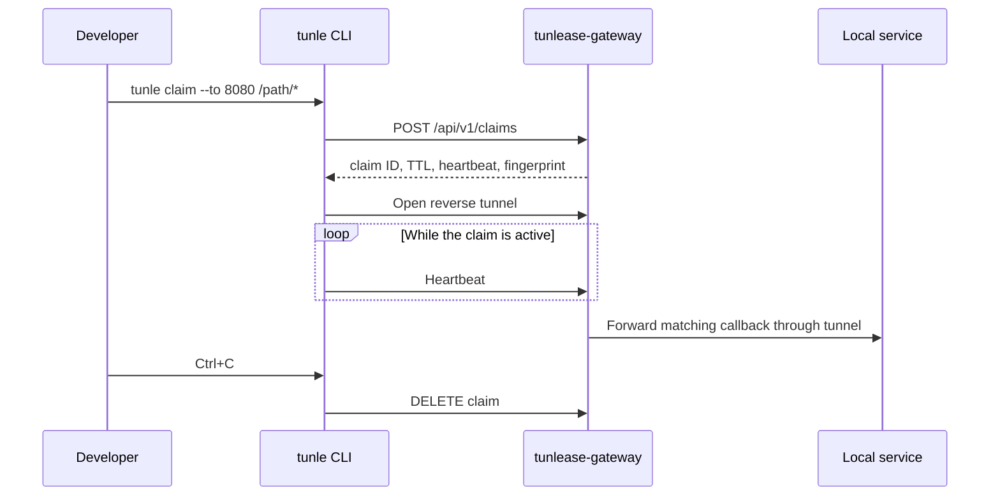

# Architecture

[English](architecture.md) · [繁體中文](architecture.zh-TW.md)

## System overview

Blue nodes are owned and shipped by tunlease; neutral nodes are third-party systems or existing infrastructure and applications. The gateway sits in front of the app and demuxes traffic by path itself: requests under `control_prefix` (default `/_tunlease`) hit the claim API; every other path is third-party traffic. The control plane consists of claims, heartbeats, and leases. The data plane is the request path through the gateway to either the reverse tunnel or, on an unmatched path or tunnel failure, the original app (`fail_open_url`). The gateway never depends on Kubernetes APIs.

## Request routing

The gateway uses longest-prefix matching against active claims. A path with no matching claim, or a claim whose tunnel does not respond, takes the original-app path (`fail_open_url`); if `fail_open_url` is unset, it returns 404.

## Claim lifecycle

## Gateway Pod replacement

With the in-memory registry, replacing the gateway Pod removes all leases and tunnels. This is intentional for the current single-replica deployment:

1. The gateway can no longer match the old claim and fails open to the original app.
2. The CLI reconnects, discovers that its lease no longer exists, and creates a new claim.
3. The CLI builds a new tunnel and the gateway registers the new claim.
4. Matching callbacks resume forwarding to the local service.

This behavior has been verified in a staging environment; callback forwarding recovered in approximately 17 seconds without returning gateway-generated 5xx responses.

## Deployment boundary

The core protocol does not require Kubernetes. Kubernetes provides the current packaging and lifecycle model:

- Helm deploys the gateway, Service, Ingress, and configuration Secret.
- The gateway is deployed in front of the app: Ingress routes the fixed endpoint to the gateway, and the gateway's `fail_open_url` points at the app's Service.
- Public hosts, paths, and third-party configuration remain unchanged.
