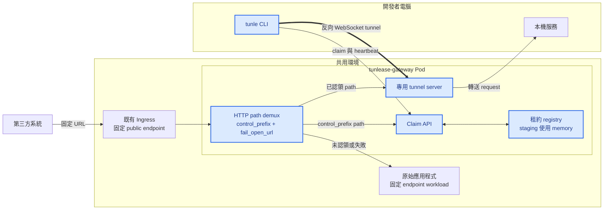
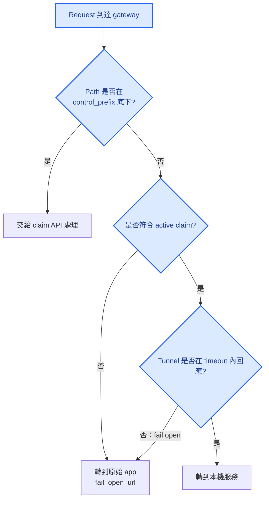
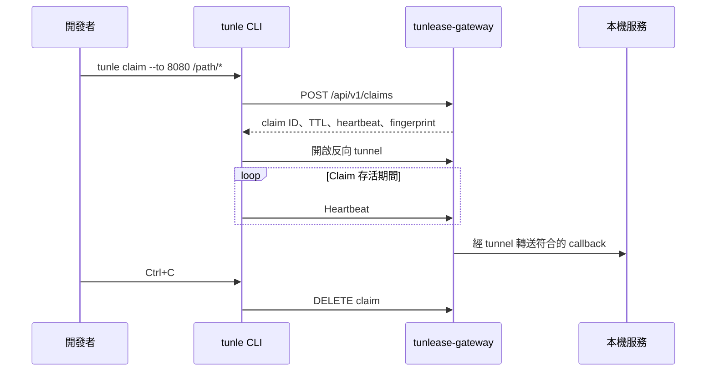

# 架構

[English](architecture.md) · [繁體中文](architecture.zh-TW.md)

## 系統概觀

藍色節點由 Tunlease 擁有並發布；其他節點是第三方系統或環境中既有的基礎設施與應用程式。Gateway 位於 app 前面，並自行依 path 分流：走 `control_prefix`（預設 `/_tunlease`）的 request 進 claim API，其餘 path 則是第三方流量。Control plane 包含 claim、heartbeat 與 lease；data plane 則是 request 經 gateway 前往反向 tunnel，或在未認領 path 或 tunnel 失敗時回到原始 app（`fail_open_url`）的路徑。Gateway 不依賴 Kubernetes API。

## Request routing

Gateway 對 active claim 使用 longest-prefix matching。沒有符合 claim 的 path，或 claim 的 tunnel 無回應時，會走原始 app 路徑（`fail_open_url`）；若未設定 `fail_open_url` 則回傳 404。

## Claim 生命週期

## Gateway Pod 替換

使用 memory registry 時，替換 gateway Pod 會移除所有 lease 與 tunnel。這是目前單 replica 部署的預期行為：

1. Gateway 無法再對到舊 claim，先 fail-open 回原始 app。
2. CLI reconnect 後發現 lease 不存在，建立新 claim。
3. CLI 建立新 tunnel，gateway 註冊新 claim。
4. 符合的 callback 恢復轉送到本機服務。

這個行為已在 staging 環境驗證；callback 約 17 秒內恢復，過程沒有回傳 gateway 產生的 5xx。

## 部署邊界

核心 protocol 不要求 Kubernetes。Kubernetes 只是目前的 packaging 與 lifecycle 模型：

- Helm 部署 gateway、Service、Ingress 與 config Secret。
- Gateway 部署在 app 前面：Ingress 把固定 endpoint 導向 gateway，gateway 的 `fail_open_url` 指向 app 的 Service。
- Public host、path 與第三方設定完全不變。
