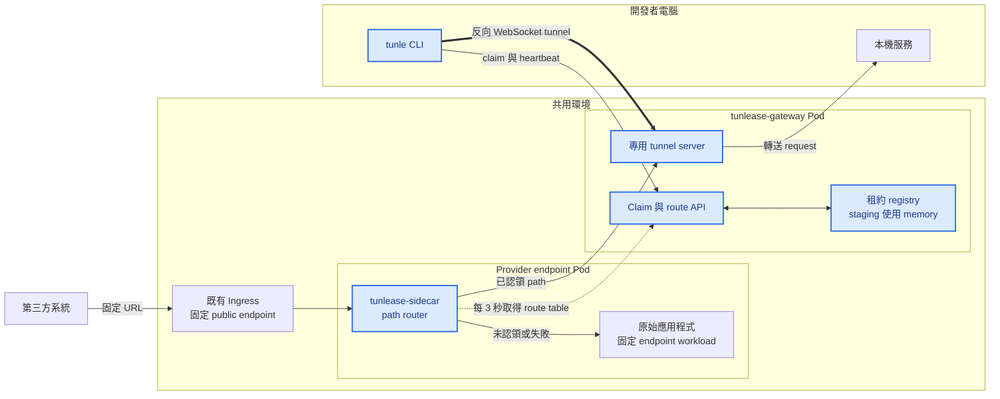
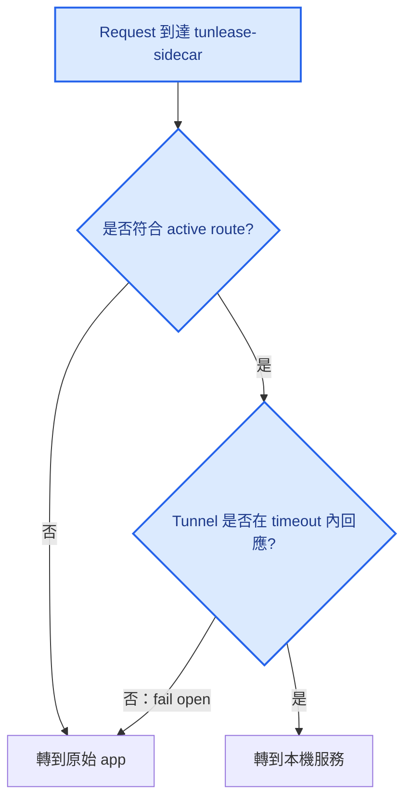
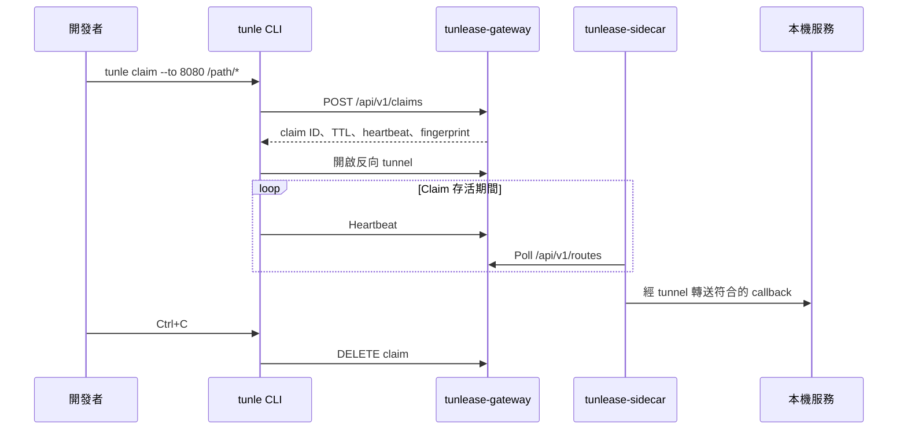

# 架構

[English](architecture.md) · [繁體中文](architecture.zh-TW.md)

## 系統概觀

藍色節點由 Tunlease 擁有並發布；其他節點是第三方系統或環境中既有的基礎設施與應用程式。Control plane 包含 claim、heartbeat、lease 與 route-table polling；data plane 則是 request 經 sidecar 前往原始 app 或反向 tunnel 的路徑。Sidecar 不依賴 Kubernetes API。

## Request routing

Sidecar 使用 longest-prefix matching。Route table 超過最大 stale 時間仍無法更新時，會清空 route table，讓所有 request 回到原始 app。

## Claim 生命週期

## Gateway Pod 替換

使用 memory registry 時，替換 gateway Pod 會移除所有 lease 與 tunnel。這是目前單 replica 部署的預期行為：

1. Sidecar 無法連到舊 tunnel，先 fail-open 回原始 app。
2. CLI reconnect 後發現 lease 不存在，建立新 claim。
3. CLI 建立新 tunnel，sidecar 取得新 route。
4. 符合的 callback 恢復轉送到本機服務。

這個行為已在 staging 環境驗證；callback 約 17 秒內恢復，過程沒有回傳 gateway 產生的 5xx。

## 部署邊界

核心 protocol 不要求 Kubernetes。Kubernetes 只是目前的 packaging 與 lifecycle 模型：

- Helm 部署共用 gateway、Service、Ingress 與 config Secret。
- 目標應用程式在自己有版本控制的 Deployment 中加入 `tunlease-sidecar`。
- Sidecar 接手應用程式原本的 Service port；應用程式移到 Pod-local port。
- Public host、path 與第三方設定完全不變。
