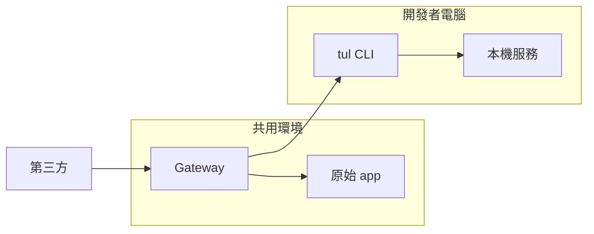

# 架構

[English](architecture.md) · [繁體中文](architecture.zh-TW.md)

Tunlease 只有四個核心概念：

- **Gateway**：位於單一 app 前方的 whole-host proxy。
- **Unclaimed target**：由 `fail_open_url` 指定的原始 app，或由
  `unclaimed_status` 指定的固定錯誤。
- **Tunnel session**：開發者的一條 WSS 長連線。
- **Claimed paths**：該連線互斥擁有的 path prefix。

WebSocket 本身就是 claim：handshake 成功便擁有 paths，連線結束便釋放。
Operator 也可設定最長 claim duration；這只是 live session 的時間上限，不是
durable lease。

## Topology 與 URL

既有 callback host 的 `/` 必須送到 gateway。`/_tunlease` 固定保留給 health、
list/release 與 tunnel WebSocket；其餘都是 data traffic。若有設定 origin，
它必須使用不會繞回 public gateway 的獨立內部 URL。

## Session lifecycle

`GET /_tunlease/tunnel` 升級成 WebSocket。認證、path 驗證、互斥 ownership、
tunnel 建立與 readiness 都在這次 handshake 完成。Gateway 與 client 會進行有
timeout 的 ready/ack；未完成的連線會釋放 paths。`Start` 只會在 data channel
可路由後返回。

網路斷線會移除 server record。Client 以舊 claim ID 作為 replacement context
重試，成功後取得新 ID；空窗期間流量送 origin。明確 release 是 terminal，
不可自動重連；gateway 會送 release control frame，只有 client ACK 後才回成功。

設定 `max_claim_duration` 時，handshake 會包含 `expires_at`。期限到達後，
gateway 送出 terminal expiry control frame、等待 client ACK、關閉 session，
並釋放 paths。

剩餘 HTTP API：

- `GET /_tunlease/api/v1/claims`
- `DELETE /_tunlease/api/v1/claims/{id}`
- `GET /_tunlease/healthz`

## 路由與失敗契約

| 狀態 | 結果 |
|---|---|
| Path 符合 connected session | 經 yamux 送 localhost |
| 沒有符合的 connected session | Proxy 到 origin，或回設定的固定錯誤 |
| Dispatch 後 tunnel/local 失敗 | 回 `502 This path is claimed, but its local service is unavailable.`；不 replay |
| Gateway 或設定的 origin unavailable | 平台 outage |

Path 必須以 `/` 開頭。不含 wildcard 的 path 是 exact；結尾的 slash 會被忽略，
因此 `/callback` 與 `/callback/` 等同。結尾 `/*` 只符合一層子 path segment；
`/**` 則符合該 path 本身與任意深度的所有子路徑。其他位置不支援 wildcard。
每條最多 512 bytes，一個 session 最多 8 條，重疊的 claim 範圍互斥。Gateway
傳送 HTTP method、path/query、headers、body 與 response；app 仍須處理
provider retry 與重複 delivery。
Proxied response 完成後，gateway 會透過獨立 yamux stream，將 best-effort
activity event 送給 owner client。內容只有 method、不含 query 的 path、
response status 與 duration；activity reporting 不會阻塞 response，也不會
解析 tunneled HTTP stream。

## 部署邊界

v1 只支援單一 gateway process 與 in-memory state。WebSocket session 是
process-local，因此多 replica 不安全。Gateway 重啟會產生 reconnect gap，
不保留 active claim。Transport security 由外層 HTTPS/WSS 提供，tunnel
內沒有第二層 TLS。
