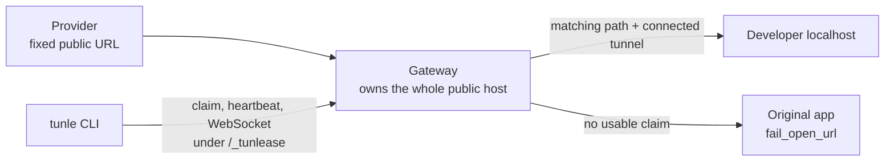

# Tunlease concepts

[English](concepts.md) · [繁體中文](concepts.zh-TW.md)

This page is the canonical model for Tunlease URLs, routing, claims, and
failures. Deployment and client guides use these terms with the same meanings.

## One concrete topology

Assume a provider already calls:

```text
https://callbacks.staging.example.com/webhooks/stripe/payment
```

Tunlease does not change that URL. The existing public host is routed to the
gateway, and the original application remains reachable at a separate internal
origin:

| Name | Example | Meaning |
|---|---|---|
| Public callback host | `callbacks.staging.example.com` | Existing host stored by the provider; all paths on this host enter the gateway |
| Callback path | `/webhooks/stripe/payment` | Data-plane request that may match a claim |
| Control prefix | `/_tunlease` | Reserved gateway namespace; the original app must not own it |
| Gateway value given to the CLI | `callbacks.staging.example.com` | Bare public host; the client appends the control prefix |
| Claim API | `https://callbacks.staging.example.com/_tunlease/api/v1/claims` | Control-plane endpoint |
| Tunnel WebSocket | `wss://callbacks.staging.example.com/_tunlease/tunnel` | Long-lived developer-to-gateway connection |
| Fail-open origin | `http://callback-app.default.svc` | Separately addressable original app; it must not resolve back through the gateway |



Do not mount the gateway only under a path such as `/tunlease` while leaving
callback paths routed directly to the app. The gateway must see both its
reserved control prefix and every callback path it may route.

## Vocabulary

- **Claim** — a request for exclusive ownership of one or more path prefixes.
- **Lease** — the temporary server-side record created for a claim. It expires
  unless the client sends heartbeats.
- **Tunnel** — the live WebSocket data connection used to carry HTTP requests
  between the gateway and a developer's local service.
- **Owner** — the identity derived from the gateway token. Clients cannot
  choose it. With authentication disabled, all clients are `anonymous`.
- **Control plane** — claim, list, release, and heartbeat operations under
  `control_prefix`.
- **Data plane** — provider HTTP traffic routed to either the tunnel or the
  original app.
- **Fail open** — route a request to `fail_open_url` when the healthy gateway
  cannot select a usable tunnel before dispatch.

A lease and a tunnel are related but not identical. A lease can briefly exist
without a connected tunnel; such traffic goes to the original app.

## Path model

Claims are case-sensitive path-prefix patterns. Paths must start with `/`; the
CLI normalizes a path to a trailing `/*` prefix pattern. A wildcard is valid
only at the end. Query strings are not part of matching.

Examples:

| Claim | Matches | Does not match |
|---|---|---|
| `/webhooks/stripe/*` | `/webhooks/stripe`, `/webhooks/stripe/payment`, `/webhooks/stripe/payment/1` | `/webhooks/stripe-old/payment` |
| `/a/b/*` | `/a/b/c` | `/a/bc` |

Overlapping claims cannot coexist. Claim the narrowest prefix required, and
test the provider's exact encoded URL end to end; proxies may normalize paths
before the gateway sees them. `control_prefix` is reserved and cannot be used
as an application callback namespace.

## Routing and failure contract

| State when request arrives | Result |
|---|---|
| Control-prefix path | Handled by the gateway control plane |
| No matching active lease | Proxy to `fail_open_url`, or 404 if it is unset |
| Matching lease but no connected tunnel | Proxy to `fail_open_url`, or 404 if it is unset |
| Tunnel selected and local service responds | Return the local response to the provider |
| Tunnel fails after dispatch begins | Request may return an error; Tunlease does not promise replay to the origin |
| Gateway, Service, Ingress, or load balancer unavailable | Upstream connection failure unless the operator provides HA or bypass routing |
| Original app unavailable | Fail-open proxy fails |

The boundary matters for webhook correctness. Replaying a request to the
original app after localhost may already have processed it can cause duplicate
side effects. Applications must remain idempotent and providers may also retry
failed or timed-out callbacks.

## HTTP and trust boundaries

Tunlease carries the HTTP method, path/query, headers, body, and local response
through an HTTP reverse proxy over the tunnel. Reverse proxies may add or remove
hop-by-hop and forwarding headers, and public TLS terminates before the request
reaches localhost. Validate signature schemes that depend on the raw body,
host, scheme, or forwarded headers with the real provider.

Real staging payloads—including credentials or personal data—reach the
developer machine. Use only authorized staging endpoints, narrow allowlists,
per-developer tokens, appropriate laptop/logging controls, and application-level
idempotency.

The developer machine needs outbound HTTPS/WSS access. Corporate proxies, TLS
inspection, VPN policy, load-balancer WebSocket limits, and idle timeouts can
interrupt the tunnel. The client reconnects, but a reconnect gap routes traffic
to the origin.

## Current deployment boundary

- Chart defaults are one replica, a memory registry, 300-second lease TTL,
  30-second heartbeat, and 64 active claims. Operators can change these values;
  reconnect timing is not an SLA.
- The current data plane is single-replica. Redis can preserve leases, but
  WebSocket sessions remain process-local; Redis alone does not make multiple
  gateway replicas safe.
- `healthz` proves only that the gateway process can answer HTTP. It does not
  prove origin, Redis, tunnel, DNS, or external load-balancer health.
- Fail-open is routing performed by a healthy gateway, not an HA mechanism.
- A managed public relay is possible, but the operator still needs control of
  the fixed hostname's routing and TLS certificate plus a separately reachable
  origin. The current project distributes a self-hosted gateway.

Configuration names differ by layer:

| Concept | Gateway YAML | Helm value | Client YAML |
|---|---|---|---|
| Public gateway | — | `ingress.host` | `gateway` |
| Control namespace | `control_prefix` | `config.controlPrefix` | appended automatically |
| Original app | `fail_open_url` | `config.failOpenURL` | — |
| Redis URL | `redis_url` | `config.redisURL` | — |
| TLS verification bypass | — | — | `insecure` |

Changing gateway/Helm configuration requires a rollout; it is not dynamically
reloaded.
