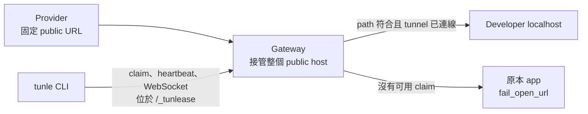

# Tunlease 核心概念

[English](concepts.md) · [繁體中文](concepts.zh-TW.md)

本頁是 Tunlease URL、routing、claim 與失敗行為的權威模型。部署及 client
指南都應使用相同定義。

## 一個具體拓撲

假設 provider 已經呼叫：

```text
https://callbacks.staging.example.com/webhooks/stripe/payment
```

Tunlease 不改變這個 URL。既有 public host 的全部流量改送 gateway，原本的
app 則保留一個可獨立連線的內部 origin：

| 名稱 | 範例 | 意義 |
|---|---|---|
| Public callback host | `callbacks.staging.example.com` | Provider 已儲存的既有 host；此 host 的所有 path 都先進 gateway |
| Callback path | `/webhooks/stripe/payment` | 可能符合 claim 的 data-plane request |
| Control prefix | `/_tunlease` | Gateway 保留 namespace；原 app 不可使用 |
| 提供給 CLI 的 gateway 值 | `callbacks.staging.example.com` | Public host；client 自動附加 control prefix |
| Claim API | `https://callbacks.staging.example.com/_tunlease/api/v1/claims` | Control-plane endpoint |
| Tunnel WebSocket | `wss://callbacks.staging.example.com/_tunlease/tunnel` | Developer 到 gateway 的長連線 |
| Fail-open origin | `http://callback-app.default.svc` | 可獨立連線的原 app；不可繞回 gateway |



不要只把 gateway 掛在 `/tunlease` 等單一路徑、卻讓 callback path 直接進 app。
Gateway 必須同時看到保留的 control prefix 與所有可能被 claim 的 callback path。

## 詞彙

- **Claim**：要求獨占一個或多個 path prefix。
- **Lease**：claim 建立的暫時性 server record；client 沒送 heartbeat 就會過期。
- **Tunnel**：gateway 與本機服務之間傳送 HTTP request 的 WebSocket data connection。
- **Owner**：由 gateway token 決定的身分，client 無法自行指定。未啟用驗證時，
  所有 client 都是 `anonymous`。
- **Control plane**：`control_prefix` 下的 claim、list、release 與 heartbeat。
- **Data plane**：送往 tunnel 或原 app 的 provider HTTP traffic。
- **Fail open**：健康的 gateway 在 dispatch 前找不到可用 tunnel 時，把 request
  送到 `fail_open_url`。

Lease 與 tunnel 有關但不相同。Lease 可能短暫存在但 tunnel 尚未連線，此時流量會送回原 app。

## Path 模型

Claim 是區分大小寫的 path-prefix pattern。Path 必須以 `/` 開頭；CLI 會正規化成
尾端為 `/*` 的 prefix pattern。Wildcard 只能出現在最後，query string 不參與 matching。

| Claim | 會符合 | 不會符合 |
|---|---|---|
| `/webhooks/stripe/*` | `/webhooks/stripe`、`/webhooks/stripe/payment`、`/webhooks/stripe/payment/1` | `/webhooks/stripe-old/payment` |
| `/a/b/*` | `/a/b/c` | `/a/bc` |

重疊的 claim 不能同時存在。只 claim 所需的最窄 prefix，並用 provider 的實際 encoded
URL 做 end-to-end 測試，因為 proxy 可能先正規化 path。`control_prefix` 是保留 namespace，
不可作為 application callback path。

## Routing 與失敗契約

| Request 抵達時的狀態 | 結果 |
|---|---|
| Control-prefix path | 由 gateway control plane 處理 |
| 沒有符合的 active lease | Proxy 到 `fail_open_url`；未設定則回 404 |
| Lease 符合但 tunnel 未連線 | Proxy 到 `fail_open_url`；未設定則回 404 |
| 已選 tunnel 且本機服務正常回應 | 把本機 response 回給 provider |
| Dispatch 開始後 tunnel 失敗 | Request 可能回錯；Tunlease 不保證 replay 到 origin |
| Gateway、Service、Ingress 或 load balancer 無法使用 | 除非 operator 另做 HA/bypass，否則連線失敗 |
| 原 app 無法使用 | Fail-open proxy 失敗 |

這個界線會影響 webhook 正確性：localhost 可能已處理 request，再 replay 到原 app
會造成重複副作用。Application 必須保持 idempotent，provider 也可能 retry 失敗或 timeout 的 callback。

## HTTP 與信任邊界

Tunlease 透過 tunnel 內的 HTTP reverse proxy 傳送 method、path/query、headers、body
及本機 response。Reverse proxy 可能增刪 hop-by-hop／forwarding headers，public TLS
也會在 request 抵達 localhost 前終止。若 signature 依賴 raw body、host、scheme
或 forwarded headers，請用真實 provider 驗證。

真實 staging payload（包含 credential 或個資）會到達開發者電腦。只使用已授權的
staging endpoint、最窄 allowlist、每人 token、適當的 laptop/log 管控與 application-level idempotency。

開發者電腦需要 outbound HTTPS/WSS。Corporate proxy、TLS inspection、VPN policy、
load-balancer WebSocket 上限與 idle timeout 都可能中斷 tunnel。Client 會重連，
但重連空窗的流量會送往 origin。

## 目前部署邊界

- Chart 預設為 one replica、memory registry、300 秒 lease TTL、30 秒 heartbeat
  與 64 個 active claim。Operator 可修改；reconnect timing 不是 SLA。
- 目前 data plane 是 single-replica。Redis 可保留 lease，但 WebSocket session
  仍在單一 process；只有 Redis 並不能安全支援多 gateway replica。
- `healthz` 只證明 gateway process 能回 HTTP，不代表 origin、Redis、tunnel、
  DNS 或外部 load balancer 正常。
- Fail-open 是健康 gateway 執行的 routing，不是 HA 機制。
- Managed public relay 技術上可行，但 operator 仍需控制固定 hostname 的 routing、
  TLS certificate，並提供可獨立連線的 origin。目前專案提供 self-hosted gateway。

各層 config key 不同：

| 概念 | Gateway YAML | Helm value | Client YAML |
|---|---|---|---|
| Public gateway | — | `ingress.host` | `gateway` |
| Control namespace | `control_prefix` | `config.controlPrefix` | 自動附加 |
| 原 app | `fail_open_url` | `config.failOpenURL` | — |
| Redis URL | `redis_url` | `config.redisURL` | — |
| 跳過 TLS verification | — | — | `insecure` |

修改 gateway/Helm config 需要 rollout，不會 dynamic reload。
