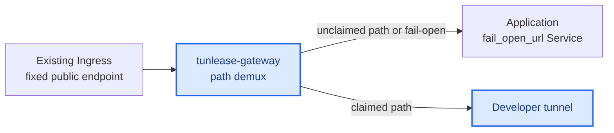
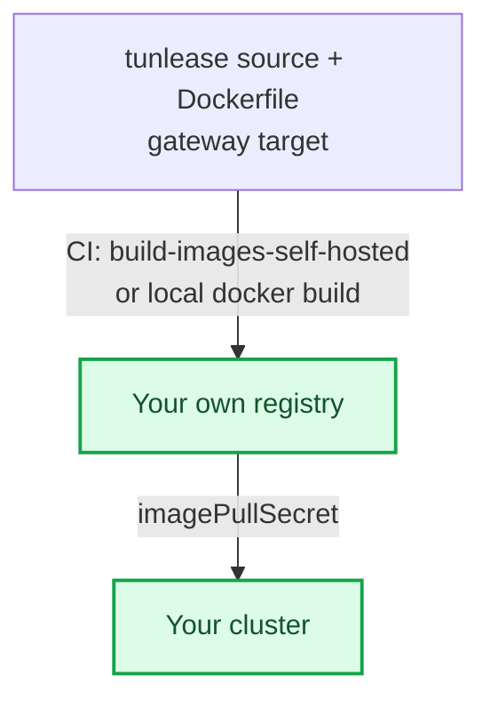

# Platform deployment guide

[English](platform-deployment.md) · [繁體中文](platform-deployment.zh-TW.md)

Deploy the `tunlease-gateway` in front of the app that owns the third party's fixed endpoint: Ingress routes the fixed endpoint to the gateway, and the gateway's `fail_open_url` points at the app's Service. The public URL does not change. The gateway serves its control plane under `control_prefix` and demuxes every other path itself — tunnelling claimed paths to the developer and failing open to the app for everything else.

Start with [Tunlease concepts](concepts.md) for the canonical URL map and
failure boundary. See [Architecture](architecture.md) for implementation details.



Blue nodes are deployed from this repository. Neutral nodes belong to the existing target service.

## Decide before deploying

- Identify the existing staging callback host, for example
  `callbacks.staging.example.com`. The gateway must receive `/` on this host,
  not only a separate `/tunlease` mount.
- Ensure the original app has a separately reachable internal origin for
  `fail_open_url`; it must not resolve back through the public gateway.
- The path allowlist is optional: leave it empty to allow any path (convenient on a trusted network), or set the narrowest prefixes that cover your callbacks to stop anyone claiming sensitive paths like `/` or `/admin`.
- Client tokens are optional. Configure one token per developer for gateways outside a trusted development network.
- Keep the v1 gateway at one replica. Tunnel sessions are process-local, so
  Redis preserves lease records but does not make a multi-replica data plane
  safe.
- Ensure the Ingress supports WebSocket upgrades and read/send timeouts of at least 3600 seconds.
- Reserve `control_prefix` (`/_tunlease` by default) on the public host.

## Same-domain deployment (default)

The recommended and default topology is *same-domain*: the gateway sits in front
of one app on one host. The control plane is served under a configurable URL path
prefix, `control_prefix`, which defaults to `/_tunlease`. So the claim API lives at
`<host>/_tunlease/api/v1/claims`, the tunnel WebSocket at `<host>/_tunlease/tunnel`,
and health at `<host>/_tunlease/healthz`.

Every other path is treated as third-party traffic. When a request matches an
active claim, the gateway tunnels it to the developer's localhost. When it does
not, the gateway *fails open* to `fail_open_url` — the original app — or returns
`404` if `fail_open_url` is unset.

Two gateway config keys govern this:

```yaml
config:
  # URL path prefix for the control plane. Defaults to /_tunlease when unset.
  controlPrefix: /_tunlease
  # Where unclaimed third-party traffic falls open to (the original app).
  # If unset, unmatched paths return 404 instead.
  failOpenURL: http://myapp-origin.default.svc
```

These are Helm values. The rendered gateway YAML uses `control_prefix` and
`fail_open_url`; [the values table](../charts/tunlease/values.yaml) is the
authoritative chart interface.

The control plane lives under this prefix on the gateway, but developers do not
put it in their gateway URL — the client appends the control-plane prefix
automatically and defaults the scheme to `https`. Hand out the bare host,
`myapp.example.com`.

Mounting the control plane on a separate host or mounting only the gateway under
`/tunlease` is not the current supported topology.

## Self-hosting prerequisites

The chart ships with a placeholder registry, Ingress controller, and host. A
team deploying to their own cluster must handle three things first, or the
gateway will not start or will not be reachable.

The image source is the crux: a cluster can only pull from a registry it has
credentials for. You must publish the images to a registry your cluster can
pull from, then point the chart at it:



- **Image.** `charts/tunlease/values.yaml` points at a placeholder registry
  (`your-registry.example.com/...`). A cluster with no pull access to the
  configured registry will `ImagePullBackOff`. Either obtain a pull secret for
  that registry, or build and push the image to your own registry. The repo
  ships a manual CI job for this — `build-images-self-hosted` — which builds the
  gateway target and pushes to `TARGET_REGISTRY`. When you point
  `TARGET_REGISTRY` at your own registry, also set
  `REGISTRY_HOST`/`REGISTRY_USER`/`REGISTRY_PASSWORD` so the login targets it
  too. To build locally instead:

  ```bash
  # Build the gateway target from the repo Dockerfile and push to your registry.
  docker build --target gateway -t YOUR_REGISTRY/tunlease-gateway:TAG .
  docker push YOUR_REGISTRY/tunlease-gateway:TAG
  ```

  Then set `image.repository`/`image.tag` in your values and add an
  `imagePullSecret` for your registry.

- **Ingress controller.** The chart defaults to `ingressClassName: nginx` and
  nginx WebSocket timeout annotations. On another controller (Traefik, AWS
  ALB, ...), replace `ingress.className` and annotations with that controller's
  timeout equivalents. Route the whole host at path `/` without rewriting the
  callback path.

- **DNS and TLS.** Nothing provisions the host for you. Point the existing
  callback host (the chart placeholder is `callbacks.staging.example.com`) at
  the Ingress and issue a certificate for it. The tunnel handshake is `wss://`;
  a production gateway must terminate trusted TLS on that host.

### CI deploy example

If you deploy from CI to a cluster where a shared deploy template already wires
up your cloud credentials, registry login, and `kubectl` context, a job then
only needs to build the secret and apply the manifest:

```yaml
tunlease-staging:
  extends: .deploy-template   # your own shared deploy template
  stage: staging
  when: manual
  variables:
    NAMESPACE: tunlease
    DEPLOY_FOLDER: ./tunlease
  script:
    - cd ${DEPLOY_FOLDER}
    # Literal substitution (perl, not raw sed) so & | \ or quotes in a rotated
    # token can't corrupt the rendered config.
    - TUNLEASE_CLIENT_TOKEN="$TUNLEASE_CLIENT_TOKEN" perl -pe 's/\$\{TUNLEASE_CLIENT_TOKEN\}/$ENV{TUNLEASE_CLIENT_TOKEN}/g' config.stg.tmpl.yaml > /tmp/tunlease-config.yaml
    - kubectl create secret generic tunlease-gateway-config -n ${NAMESPACE} --from-file=config.yaml=/tmp/tunlease-config.yaml --dry-run=client -o yaml | kubectl apply -f -
    - kubectl apply -f deployment-stg.yaml
    - kubectl rollout status deployment/tunlease-gateway -n ${NAMESPACE} --timeout=120s
```

Any client tokens are masked CI/CD variables substituted into the rendered
gateway config.

If your shared template hardcodes a specific cluster name or registry, do not
`extends` it. Keep the `script` steps above, but supply your own
`before_script` that authenticates to your registry and sets your `kubectl`
context.

## Install the gateway

The chart defaults to `auth.tokens: []`, which disables client authentication. This is convenient on a trusted development network, but every reachable client then shares the `anonymous` owner and can list or release any claim.

With tokens enabled, every authenticated user can list all claims and see owner,
paths, and expiry; only the claim owner can heartbeat or release it. The current
gateway config has no delegated admin/rotation API: issue, rotate, and revoke
tokens through the secret-management and gateway rollout process.

For an authenticated deployment, never commit real tokens to values. Use a controlled private values file or CI secrets:

```yaml
# values.private.yaml — do not commit
image:
  repository: YOUR_REGISTRY/tunlease-gateway
  tag: IMAGE_VERSION
ingress:
  # The existing host already stored by the provider.
  host: callbacks.staging.example.com
  path: /
config:
  registry: redis
  redisURL: redis://redis.example:6379/0
  # The gateway fronts the app: unclaimed paths fall open here.
  failOpenURL: http://myapp-origin.default.svc
  whitelist:
    - /webhooks/provider/
auth:
  tokens:
    - owner: alice
      token: ALICE_TOKEN
```

```bash
helm upgrade --install tunlease charts/tunlease \
  --namespace tunlease --create-namespace \
  -f values.private.yaml

kubectl -n tunlease rollout status deployment/tunlease
```

The chart routes path `/` on the existing callback host to the gateway without
rewriting it. The control plane lives at `control_prefix` (default
`/_tunlease`): the claim API at `/_tunlease/api/v1/*`, tunnel WebSocket at
`/_tunlease/tunnel`, and health at `/_tunlease/healthz`. Every other path is
third-party traffic. Do not strip WebSocket upgrade headers.

Keep `replicaCount: 1` with either registry. Redis shares leases but established
tunnels remain process-local; a callback routed to another replica cannot use
that tunnel.

## Front the app with the gateway

The gateway itself plays the "sits in front of the app" role — there is no separate process to add to the workload. Deploy it so the fixed endpoint's traffic flows Ingress → gateway → (tunnel | fail-open to app):

1. Route the fixed endpoint's Ingress at the gateway instead of the app directly.
   Remove or update any competing host+`/` route; two Ingress objects claiming
   the same route have controller-specific, unsafe precedence.
2. Set the gateway's `fail_open_url` (chart key `config.failOpenURL`) to the app's Service, such as `http://myapp-origin.default.svc`.
3. Leave the control plane under `control_prefix` (default `/_tunlease`); the app must not own that path prefix.
4. Do not change the public host or the endpoint stored by the third party.

With `fail_open_url` set, an unclaimed path or a matching lease without a
connected tunnel is proxied to the app. Once dispatch through a tunnel begins,
a later tunnel/local failure may return an error rather than replaying the
request to the app.

After rollout, confirm the gateway Pod is Ready and test an unclaimed path to ensure it still reaches the app.

## Failure semantics

- A path with no matching claim is proxied to `fail_open_url` (or returns 404
  when it is unset).
- A matching lease without a connected developer tunnel follows the same path.
- A failure after tunnel dispatch starts may return an error. Automatic replay
  could duplicate a callback already processed by localhost.
- CLI disconnection is handled by reconnect and pre-dispatch fail-open.
  Gateway, Service, Ingress, load-balancer, or origin outages require normal
  platform HA/bypass handling and are outside gateway fail-open.

With the in-memory registry, replacing the gateway Pod removes all claims and
tunnels. Once the replacement is reachable, active CLIs detect the missing
lease, create a new claim, and rebuild their tunnels. During the reconnect gap,
a healthy replacement gateway proxies unmatched paths to the app. Redis
preserves leases but not tunnel sessions or Pod identity.

## Verify the deployment

```bash
# Gateway process health (replace with the existing callback host)
curl -fsS https://callbacks.staging.example.com/_tunlease/healthz

# An unclaimed path falls open to the app.
curl -fsS https://callbacks.staging.example.com/webhooks/provider/example

kubectl -n tunlease get pods
kubectl -n tunlease logs deployment/tunlease --since=10m
```

For an end-to-end check: verify an unclaimed path reaches the app, run `tunle
claim` and verify it reaches localhost, then press Ctrl+C and verify it returns
to the app. Interrupt only the developer tunnel to test fail-open. Test gateway
outage separately against the platform's HA or bypass design.

## Observability

The gateway writes JSON audit events for claim, release, and expiry with owner,
path, claim ID, and time. It does not currently expose route metrics. Derive
HTTP status, origin/tunnel routing, latency, and connection signals from
Ingress/access logs or add external telemetry. Monitor active leases, reconnect
churn, 502 responses, origin health, and an end-to-end synthetic callback.

`/_tunlease/healthz` is process liveness only. It does not check Redis, the
origin, an active tunnel, DNS, or external load-balancer reachability.

## Security, privacy, and capacity

- Use per-developer tokens outside a trusted network. Tokens authorize access;
  edge rate limits, request/header/body limits, and connection quotas are still
  required for an Internet-reachable gateway.
- `--insecure` removes outer TLS server authentication. Because the tunnel
  fingerprint is obtained through that outer connection, inner pinning does not
  protect against a full man-in-the-middle. Prefer a trusted internal CA.
- Real staging payloads reach developer laptops. Apply data-classification,
  endpoint authorization, log-retention, and laptop-security policies.
- Size upstream timeouts, file descriptors, memory, and bandwidth for concurrent
  callbacks and slow local services. The current gateway does not define a
  universal body-size or per-request deadline; enforce appropriate limits at
  the edge and test provider retry behavior.
- During Pod termination, drain long-lived WebSockets and expect clients to
  reconnect. Record each load balancer's idle and maximum connection duration;
  a 3600-second timeout is a baseline, not a portability guarantee.

## Roll back

Stop new claims, then point the fixed endpoint's Ingress back at the app directly. The public Service, host, and endpoint stored by the third party do not change. Once no consumers remain, remove the gateway with `helm uninstall tunlease -n tunlease`.
