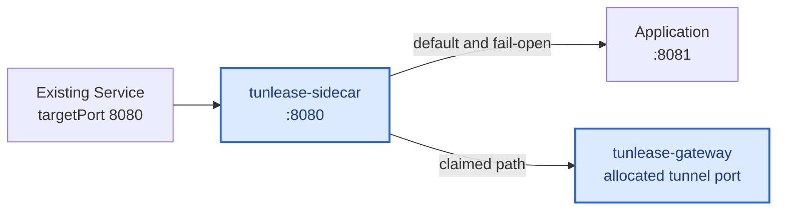
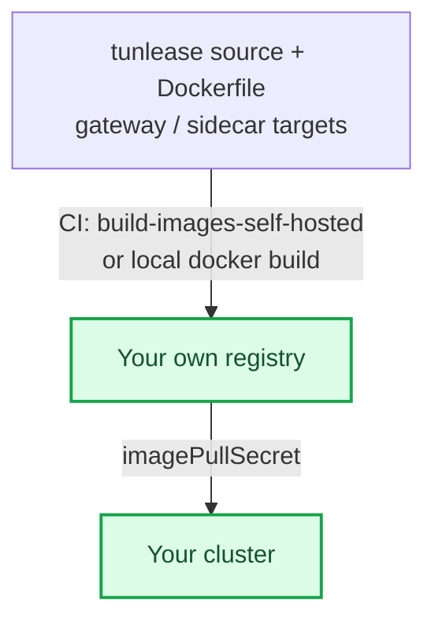

# Platform deployment guide

[English](platform-deployment.md) · [繁體中文](platform-deployment.zh-TW.md)

Deployment has two parts: install the shared `tunlease-gateway`, then add `tunlease-sidecar` to the workload that owns the third party's fixed endpoint. The sidecar does not change the public URL. It takes over the existing Service port and forwards unclaimed or failed traffic to the app in the same Pod.

See [Architecture](architecture.md) for the complete control plane, data plane, request routing, and Pod-replacement flow.



Blue nodes are deployed from this repository. Neutral nodes belong to the existing target service.

## Decide before deploying

- Choose an internal or staging Ingress host and path, for example `tunlease.example.com`.
- The path allowlist is optional: leave it empty to allow any path (convenient on a trusted network), or set the narrowest prefixes that cover your callbacks to stop anyone claiming sensitive paths like `/` or `/admin`.
- Client tokens are optional. Configure one token per developer for gateways outside a trusted development network. The sidecar route-table token is a distinct secret from client tokens, but the gateway and the sidecar must share the *same* value for it (see [Add the sidecar](#add-the-sidecar)).
- Keep the v1 gateway at one replica. The memory registry is the current default: on Pod replacement, the CLI creates a fresh lease and tunnel while the sidecar sends traffic to the app. Use Redis only when persistent leases or multiple replicas are explicitly required.
- Ensure the Ingress supports WebSocket upgrades and read/send timeouts of at least 3600 seconds.

## Same-domain deployment (default)

The recommended and default topology is *same-domain*: the gateway sits in front
of one app on one host. The control plane is served under a configurable URL path
prefix, `control_prefix`, which defaults to `/_tunlease`. So the claim API lives at
`<host>/_tunlease/api/v1/claims`, the tunnel WebSocket at `<host>/_tunlease/tunnel`,
and health at `<host>/_tunlease/healthz`.

Every other path is treated as third-party traffic. When a request matches an
active claim, the gateway tunnels it to the developer's localhost. When it does
not, the gateway *fails open* to `fail_open_url` — the original app — or returns
`404` if `fail_open_url` is unset.

Two gateway config keys govern this:

```yaml
config:
  # URL path prefix for the control plane. Defaults to /_tunlease when unset.
  control_prefix: /_tunlease
  # Where unclaimed third-party traffic falls open to (the original app).
  # If unset, unmatched paths return 404 instead.
  fail_open_url: http://myapp-origin.default.svc
```

The control plane lives under this prefix on the gateway, but developers do not
put it in their gateway URL — the client appends the control-plane prefix
automatically and defaults the scheme to `https`. Hand out the bare host,
`myapp.example.com`.

Host-based splitting across different domains (serving the control plane on a
separate subdomain from the app) is planned but not fully implemented; document
same-domain for now.

## Self-hosting prerequisites

The chart and `deploy/sidecar-patch.yaml` ship with a placeholder registry,
Ingress controller, and host. A team deploying to their own cluster must
handle three things first, or the gateway will not start or will not be
reachable.

The image source is the crux: a cluster can only pull from a registry it has
credentials for. You must publish the images to a registry your cluster can
pull from, then point the chart at it:



- **Images.** `charts/tunlease/values.yaml` and `deploy/sidecar-patch.yaml` point
  at a placeholder registry (`your-registry.example.com/...`). A cluster with no
  pull access to the configured registry will `ImagePullBackOff`. Either obtain
  a pull secret for that registry, or build and push the images to your own
  registry. The repo ships a manual CI job for this —
  `build-images-self-hosted` — which builds both targets and pushes to
  `TARGET_REGISTRY`. When you point `TARGET_REGISTRY` at your own registry, also
  set `REGISTRY_HOST`/`REGISTRY_USER`/`REGISTRY_PASSWORD` so the login targets it
  too. To build locally instead:

  ```bash
  # Build both targets from the repo Dockerfile and push to your registry.
  docker build --target gateway -t YOUR_REGISTRY/tunlease-gateway:TAG .
  docker build --target sidecar -t YOUR_REGISTRY/tunlease-sidecar:TAG .
  docker push YOUR_REGISTRY/tunlease-gateway:TAG
  docker push YOUR_REGISTRY/tunlease-sidecar:TAG
  ```

  Then set `image.repository`/`image.tag` in your values and the sidecar image
  in your patch, and add an `imagePullSecret` for your registry.

- **Ingress controller.** The chart hardcodes `ingressClassName: nginx` and
  `nginx.ingress.kubernetes.io/*` annotations, including
  `rewrite-target: /$2`, whose capture-group behaviour is specific to
  ingress-nginx. On any other controller (Traefik, AWS ALB, ...) you must
  replace `ingress.className` and every annotation with that controller's
  equivalent for path rewrite and WebSocket timeouts.

- **DNS and TLS.** Nothing provisions the host for you. Point your chosen host
  (the chart default is `tunlease.example.com`) at your Ingress, and issue a
  certificate for it. The quick-start examples below use `http://` for brevity,
  but the tunnel handshake is `wss://` (see [spec-v1](spec-v1.md)); a
  production gateway must terminate TLS on that host.

### CI deploy example

If you deploy from CI to a cluster where a shared deploy template already wires
up your cloud credentials, registry login, and `kubectl` context, a job then
only needs to build the secret and apply the manifest:

```yaml
tunlease-staging:
  extends: .deploy-template   # your own shared deploy template
  stage: staging
  when: manual
  variables:
    NAMESPACE: tunlease
    DEPLOY_FOLDER: ./tunlease
  script:
    - cd ${DEPLOY_FOLDER}
    # Literal substitution (perl, not raw sed) so & | \ or quotes in a rotated
    # token can't corrupt the rendered config.
    - TUNLEASE_SIDECAR_TOKEN="$TUNLEASE_SIDECAR_TOKEN" perl -pe 's/\$\{TUNLEASE_SIDECAR_TOKEN\}/$ENV{TUNLEASE_SIDECAR_TOKEN}/g' config.stg.tmpl.yaml > /tmp/tunlease-config.yaml
    - kubectl create secret generic tunlease-gateway-config -n ${NAMESPACE} --from-file=config.yaml=/tmp/tunlease-config.yaml --dry-run=client -o yaml | kubectl apply -f -
    - kubectl create secret generic tunlease-sidecar-auth -n ${NAMESPACE} --from-literal=token="${TUNLEASE_SIDECAR_TOKEN}" --dry-run=client -o yaml | kubectl apply -f -
    - kubectl apply -f deployment-stg.yaml
    - kubectl rollout status deployment/tunlease-gateway -n ${NAMESPACE} --timeout=120s
```

`TUNLEASE_SIDECAR_TOKEN` is a masked CI/CD variable; the same value builds both
secrets so they always match.

If your shared template hardcodes a specific cluster name or registry, do not
`extends` it. Keep the `script` steps above, but supply your own
`before_script` that authenticates to your registry and sets your `kubectl`
context.

## Install the gateway

The chart defaults to `auth.tokens: []`, which disables client authentication. This is convenient on a trusted development network, but every reachable client then shares the `anonymous` owner and can list or release any claim.

For an authenticated deployment, never commit real tokens to values. Use a controlled private values file or CI secrets:

```yaml
# values.private.yaml — do not commit
image:
  tag: IMAGE_VERSION
config:
  registry: redis
  redisURL: redis://redis.example:6379/0
  whitelist:
    - /webhooks/provider/
auth:
  sidecarToken: SIDECAR_TOKEN
  tokens:
    - owner: alice
      token: ALICE_TOKEN
```

```bash
helm upgrade --install tunlease charts/tunlease \
  --namespace tunlease --create-namespace \
  -f values.private.yaml

kubectl -n tunlease rollout status deployment/tunlease
```

The chart defaults to the `/tunlease` Ingress path and rewrites it to the gateway root. `/api/v1/*` and `/tunnel` share the same host and path. Do not strip WebSocket upgrade headers.

Claim state lives in a single gateway process (or a shared Redis registry), and third-party traffic is demultiplexed by path over the established tunnels, so v1 must keep `replicaCount: 1` when using the in-memory registry.

## Add the sidecar

[deploy/sidecar-patch.yaml](../deploy/sidecar-patch.yaml) is a strategic merge example. Commit the actual change to the target service's version-controlled repository.

1. Move the app to a new Pod-local port, such as `8081`.
2. Let the sidecar listen on the Service's original `targetPort`, such as `8080`.
3. Point `TUNLEASE_APP_URL` to `http://127.0.0.1:8081`.
4. Point `TUNLEASE_ROUTES_URL` to the gateway Service's `/api/v1/routes`. The
   Service name is `<helm-release-name>-gateway` (so release `tunlease` gives
   `http://tunlease-gateway/api/v1/routes`). Use the fully qualified name
   (`<release>-gateway.<namespace>.svc`) if the sidecar runs in a different
   namespace.
5. Load `TUNLEASE_SIDECAR_TOKEN` from a Kubernetes Secret.
6. Probe the app on its new port; use a TCP or dedicated health probe for the sidecar.
7. Do not change the public Ingress, host, or endpoint stored by the third party.

Create the sidecar credential. Its token **must equal** the gateway's
`auth.sidecarToken` value — the gateway rejects `/api/v1/routes` with `401` when
they differ, and that mismatch is the most common sidecar startup failure:

```bash
# $SIDECAR_TOKEN must be the same value passed as auth.sidecarToken in the
# gateway values.
kubectl -n tunlease create secret generic tunlease-sidecar-auth \
  --from-literal=token="$SIDECAR_TOKEN" \
  --dry-run=client -o yaml | kubectl apply -f -
```

After rollout, confirm that both containers are Ready and test an unclaimed path to ensure the app still handles it.

## Failure semantics

- If the route API is unavailable, the sidecar uses the previous table for at most 60 seconds, then clears it and sends all traffic to the app.
- If tunnel dialing or response headers exceed one second, that request immediately falls back to the app.
- Gateway or CLI failure must affect only the development tunnel, never availability of the original service.
- The sidecar does not authenticate claims; its separate token can only read routes.

With the in-memory registry, replacing the gateway Pod intentionally removes all claims. Active CLIs detect the missing lease on heartbeat, create a new claim, and rebuild their tunnels. During that interval the sidecar fails open to the app. Redis would preserve lease records, but it would not preserve the tunnel session or Pod IP, so it does not eliminate tunnel reconnection by itself.

## Verify the deployment

```bash
# Gateway health
curl -fsS http://GATEWAY_HOST/tunlease/healthz

# The routes endpoint must require the sidecar token.
curl -o /dev/null -w '%{http_code}\n' \
  http://GATEWAY_HOST/tunlease/api/v1/routes              # expect 401
curl -fsS -H "Authorization: Bearer $SIDECAR_TOKEN" \
  http://GATEWAY_HOST/tunlease/api/v1/routes

kubectl -n tunlease get pods
kubectl -n tunlease logs deployment/TARGET -c tunlease-sidecar --since=10m
```

For an end-to-end check: verify an unclaimed path reaches the app, run `tunle claim` and verify it reaches localhost, then press Ctrl+C and verify it returns to the app. Finally interrupt the tunnel or gateway and confirm requests still fail open.

## Observability

The sidecar exposes these metrics on `:9090/metrics` by default:

- `devproxy_sidecar_requests_total{route="app|tunnel|fallback"}`
- `devproxy_sidecar_routes_age_seconds`
- `devproxy_sidecar_route_fetch_errors_total`

The gateway writes JSON audit events for claim, release, and expiry with owner, path, claim ID, and time. Consider alerts for route age, fetch errors, and unusual growth in fallback traffic.

## Roll back

Stop new claims, then roll the workload back to the previous manifest without the sidecar and with the app listening on its original port. The public Service and Ingress do not change. Once no consumers remain, keep the gateway available or remove it with `helm uninstall tunlease -n tunlease`.
