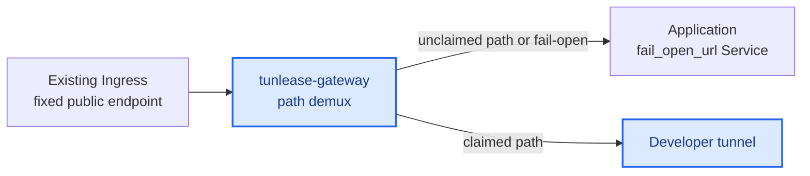
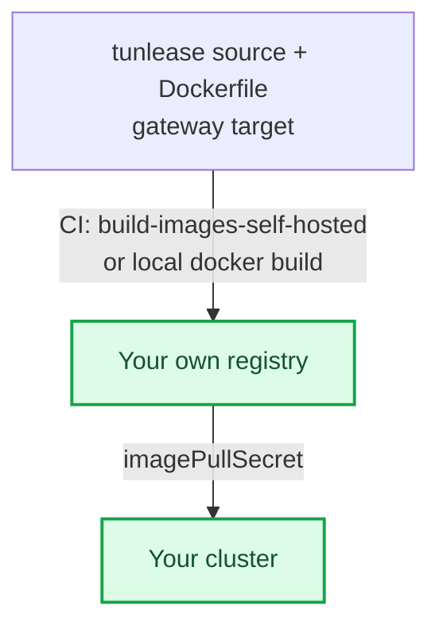

# Platform deployment guide

[English](platform-deployment.md) · [繁體中文](platform-deployment.zh-TW.md)

Deploy the `tunlease-gateway` in front of the app that owns the third party's fixed endpoint: Ingress routes the fixed endpoint to the gateway, and the gateway's `fail_open_url` points at the app's Service. The public URL does not change. The gateway serves its control plane under `control_prefix` and demuxes every other path itself — tunnelling claimed paths to the developer and failing open to the app for everything else.

See [Architecture](architecture.md) for the complete control plane, data plane, request routing, and Pod-replacement flow.



Blue nodes are deployed from this repository. Neutral nodes belong to the existing target service.

## Decide before deploying

- Choose an internal or staging Ingress host and path, for example `tunlease.example.com`.
- The path allowlist is optional: leave it empty to allow any path (convenient on a trusted network), or set the narrowest prefixes that cover your callbacks to stop anyone claiming sensitive paths like `/` or `/admin`.
- Client tokens are optional. Configure one token per developer for gateways outside a trusted development network.
- Keep the v1 gateway at one replica. The memory registry is the current default: on Pod replacement, the CLI creates a fresh lease and tunnel while the gateway fails open to the app. Use Redis only when persistent leases or multiple replicas are explicitly required.
- Ensure the Ingress supports WebSocket upgrades and read/send timeouts of at least 3600 seconds.

## Same-domain deployment (default)

The recommended and default topology is *same-domain*: the gateway sits in front
of one app on one host. The control plane is served under a configurable URL path
prefix, `control_prefix`, which defaults to `/_tunlease`. So the claim API lives at
`<host>/_tunlease/api/v1/claims`, the tunnel WebSocket at `<host>/_tunlease/tunnel`,
and health at `<host>/_tunlease/healthz`.

Every other path is treated as third-party traffic. When a request matches an
active claim, the gateway tunnels it to the developer's localhost. When it does
not, the gateway *fails open* to `fail_open_url` — the original app — or returns
`404` if `fail_open_url` is unset.

Two gateway config keys govern this:

```yaml
config:
  # URL path prefix for the control plane. Defaults to /_tunlease when unset.
  control_prefix: /_tunlease
  # Where unclaimed third-party traffic falls open to (the original app).
  # If unset, unmatched paths return 404 instead.
  fail_open_url: http://myapp-origin.default.svc
```

The control plane lives under this prefix on the gateway, but developers do not
put it in their gateway URL — the client appends the control-plane prefix
automatically and defaults the scheme to `https`. Hand out the bare host,
`myapp.example.com`.

Host-based splitting across different domains (serving the control plane on a
separate subdomain from the app) is planned but not fully implemented; document
same-domain for now.

## Self-hosting prerequisites

The chart ships with a placeholder registry, Ingress controller, and host. A
team deploying to their own cluster must handle three things first, or the
gateway will not start or will not be reachable.

The image source is the crux: a cluster can only pull from a registry it has
credentials for. You must publish the images to a registry your cluster can
pull from, then point the chart at it:



- **Image.** `charts/tunlease/values.yaml` points at a placeholder registry
  (`your-registry.example.com/...`). A cluster with no pull access to the
  configured registry will `ImagePullBackOff`. Either obtain a pull secret for
  that registry, or build and push the image to your own registry. The repo
  ships a manual CI job for this — `build-images-self-hosted` — which builds the
  gateway target and pushes to `TARGET_REGISTRY`. When you point
  `TARGET_REGISTRY` at your own registry, also set
  `REGISTRY_HOST`/`REGISTRY_USER`/`REGISTRY_PASSWORD` so the login targets it
  too. To build locally instead:

  ```bash
  # Build the gateway target from the repo Dockerfile and push to your registry.
  docker build --target gateway -t YOUR_REGISTRY/tunlease-gateway:TAG .
  docker push YOUR_REGISTRY/tunlease-gateway:TAG
  ```

  Then set `image.repository`/`image.tag` in your values and add an
  `imagePullSecret` for your registry.

- **Ingress controller.** The chart hardcodes `ingressClassName: nginx` and
  `nginx.ingress.kubernetes.io/*` annotations, including
  `rewrite-target: /$2`, whose capture-group behaviour is specific to
  ingress-nginx. On any other controller (Traefik, AWS ALB, ...) you must
  replace `ingress.className` and every annotation with that controller's
  equivalent for path rewrite and WebSocket timeouts.

- **DNS and TLS.** Nothing provisions the host for you. Point your chosen host
  (the chart default is `tunlease.example.com`) at your Ingress, and issue a
  certificate for it. The quick-start examples below use `http://` for brevity,
  but the tunnel handshake is `wss://`; a production gateway must terminate TLS
  on that host.

### CI deploy example

If you deploy from CI to a cluster where a shared deploy template already wires
up your cloud credentials, registry login, and `kubectl` context, a job then
only needs to build the secret and apply the manifest:

```yaml
tunlease-staging:
  extends: .deploy-template   # your own shared deploy template
  stage: staging
  when: manual
  variables:
    NAMESPACE: tunlease
    DEPLOY_FOLDER: ./tunlease
  script:
    - cd ${DEPLOY_FOLDER}
    # Literal substitution (perl, not raw sed) so & | \ or quotes in a rotated
    # token can't corrupt the rendered config.
    - TUNLEASE_CLIENT_TOKEN="$TUNLEASE_CLIENT_TOKEN" perl -pe 's/\$\{TUNLEASE_CLIENT_TOKEN\}/$ENV{TUNLEASE_CLIENT_TOKEN}/g' config.stg.tmpl.yaml > /tmp/tunlease-config.yaml
    - kubectl create secret generic tunlease-gateway-config -n ${NAMESPACE} --from-file=config.yaml=/tmp/tunlease-config.yaml --dry-run=client -o yaml | kubectl apply -f -
    - kubectl apply -f deployment-stg.yaml
    - kubectl rollout status deployment/tunlease-gateway -n ${NAMESPACE} --timeout=120s
```

Any client tokens are masked CI/CD variables substituted into the rendered
gateway config.

If your shared template hardcodes a specific cluster name or registry, do not
`extends` it. Keep the `script` steps above, but supply your own
`before_script` that authenticates to your registry and sets your `kubectl`
context.

## Install the gateway

The chart defaults to `auth.tokens: []`, which disables client authentication. This is convenient on a trusted development network, but every reachable client then shares the `anonymous` owner and can list or release any claim.

For an authenticated deployment, never commit real tokens to values. Use a controlled private values file or CI secrets:

```yaml
# values.private.yaml — do not commit
image:
  tag: IMAGE_VERSION
config:
  registry: redis
  redisURL: redis://redis.example:6379/0
  # The gateway fronts the app: unclaimed paths fall open here.
  failOpenURL: http://myapp-origin.default.svc
  whitelist:
    - /webhooks/provider/
auth:
  tokens:
    - owner: alice
      token: ALICE_TOKEN
```

```bash
helm upgrade --install tunlease charts/tunlease \
  --namespace tunlease --create-namespace \
  -f values.private.yaml

kubectl -n tunlease rollout status deployment/tunlease
```

The chart defaults to the `/tunlease` Ingress path and rewrites it to the gateway root. Under that root the control plane lives at `control_prefix` (default `/_tunlease`): the claim API at `/_tunlease/api/v1/*`, the tunnel WebSocket at `/_tunlease/tunnel`, and health at `/_tunlease/healthz`. Every other path is third-party traffic. Do not strip WebSocket upgrade headers.

Claim state lives in a single gateway process (or a shared Redis registry), and third-party traffic is demultiplexed by path over the established tunnels, so v1 must keep `replicaCount: 1` when using the in-memory registry.

## Front the app with the gateway

The gateway itself plays the "sits in front of the app" role — there is no separate process to add to the workload. Deploy it so the fixed endpoint's traffic flows Ingress → gateway → (tunnel | fail-open to app):

1. Route the fixed endpoint's Ingress at the gateway instead of the app directly.
2. Set the gateway's `fail_open_url` (chart key `config.failOpenURL`) to the app's Service, such as `http://myapp-origin.default.svc`.
3. Leave the control plane under `control_prefix` (default `/_tunlease`); the app must not own that path prefix.
4. Do not change the public host or the endpoint stored by the third party.

With `fail_open_url` set, any unclaimed path — and any request whose tunnel does not respond — is proxied to the app; a claimed path is tunnelled to the developer.

After rollout, confirm the gateway Pod is Ready and test an unclaimed path to ensure it still reaches the app.

## Failure semantics

- A path with no matching claim is proxied to `fail_open_url` (or returns 404 when it is unset).
- A request whose path matches no active claim, or whose developer tunnel is not connected, falls back to the app.
- Gateway or CLI failure must affect only the development tunnel, never availability of the original service.

With the in-memory registry, replacing the gateway Pod intentionally removes all claims. Active CLIs detect the missing lease on heartbeat, create a new claim, and rebuild their tunnels. During that interval the gateway fails open to the app. Redis would preserve lease records, but it would not preserve the tunnel session or Pod IP, so it does not eliminate tunnel reconnection by itself.

## Verify the deployment

```bash
# Gateway health
curl -fsS http://GATEWAY_HOST/tunlease/_tunlease/healthz

# An unclaimed path falls open to the app.
curl -fsS http://GATEWAY_HOST/webhooks/provider/example

kubectl -n tunlease get pods
kubectl -n tunlease logs deployment/tunlease --since=10m
```

For an end-to-end check: verify an unclaimed path reaches the app, run `tunle claim` and verify it reaches localhost, then press Ctrl+C and verify it returns to the app. Finally interrupt the tunnel or gateway and confirm requests still fail open.

## Observability

The gateway writes JSON audit events for claim, release, and expiry with owner, path, claim ID, and time. Consider alerts for unusual growth in fail-open traffic and for repeated claim churn.

## Roll back

Stop new claims, then point the fixed endpoint's Ingress back at the app directly. The public Service, host, and endpoint stored by the third party do not change. Once no consumers remain, remove the gateway with `helm uninstall tunlease -n tunlease`.
