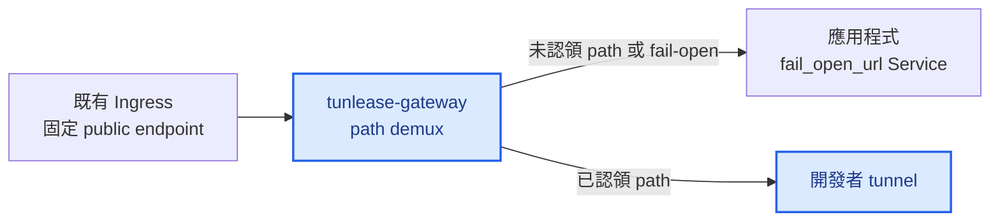
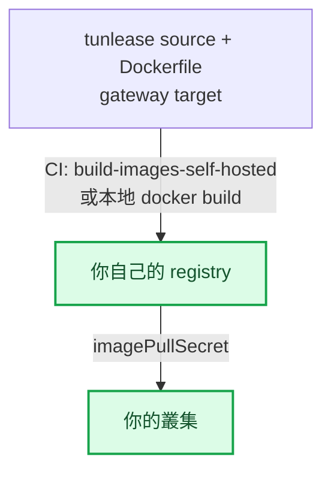

# 平台部署指南

[English](platform-deployment.md) · [繁體中文](platform-deployment.zh-TW.md)

把 `tunlease-gateway` 部署在擁有第三方固定 endpoint 的 app 前面：Ingress 把固定 endpoint 導向 gateway，gateway 的 `fail_open_url` 指向 app 的 Service。Public URL 不變。Gateway 把 control plane 放在 `control_prefix` 底下，其餘所有 path 都由它自行分流——已認領的 path tunnel 給開發者，其餘一律 fail-open 回 app。

完整 control plane、data plane、routing 與 Pod replacement 流程請看[架構](architecture.zh-TW.md)。



藍色節點由本 repo 部署；其他節點屬於既有服務。

## 部署前決定

- 選擇 internal/staging Ingress host 與 path，例如 `tunlease.example.com`。
- Path allowlist 是 optional：留空則允許任意 path（可信網路下方便），或設定涵蓋你 callback 的最小前綴，避免有人 claim `/` 或 `/admin` 這類敏感 path。
- Client token 是 optional。Gateway 位於可信開發網路之外時，應為每位開發者設定獨立 token。
- v1 gateway 保持單一 replica。Staging 預設使用 memory registry；Pod replacement 時 CLI 會重新 claim，gateway 暫時 fail-open 回 app。只有明確需要持久租約或多 replica 時才使用 Redis。
- 確認 Ingress 支援 WebSocket upgrade，read/send timeout 至少 3600 秒。

## Same-domain 部署（預設）

建議且預設的拓撲是 *same-domain*：gateway 擋在單一 app、單一 host 前面。Control
plane 服務於一個可設定的 URL 路徑前綴 `control_prefix`，預設為 `/_tunlease`。因此
claim API 位於 `<host>/_tunlease/api/v1/claims`、tunnel WebSocket 位於
`<host>/_tunlease/tunnel`、healthz 位於 `<host>/_tunlease/healthz`。

其餘所有 path 都視為第三方流量。當請求命中一個 active claim 時，gateway 會把它
tunnel 到開發者的 localhost；否則 gateway 會 *fail open* 到 `fail_open_url`——也就是
原本的 app——若 `fail_open_url` 未設定，則回傳 `404`。

有兩個 gateway config key 控制這個行為：

```yaml
config:
  # Control plane 的 URL 路徑前綴。未設定時預設為 /_tunlease。
  control_prefix: /_tunlease
  # 未被 claim 的第三方流量 fail open 的目的地（原本的 app）。
  # 若未設定，未命中的 path 會回傳 404。
  fail_open_url: http://myapp-origin.default.svc
```

gateway 上的 control plane 位於這個前綴底下，但開發者不用把它寫進 gateway URL——
client 會自動附加 control plane 的路徑前綴，scheme 也預設為 `https`。請直接發給開發者
裸 host `myapp.example.com`。

以 host 為基礎、把 control plane 拆到與 app 不同子網域的做法（different-domain）尚在
規劃、未完整實作；目前請以 same-domain 為主。

## 自架前提

Chart 預設使用 placeholder registry、Ingress controller 與 host。要部署到自己叢集的團隊必須先處理三件事，否則 gateway 起不來或連不到。

關鍵在 image 來源：叢集只能從它有憑證的 registry 拉 image。你必須把 image 推到叢集
能拉的 registry，再讓 chart 指向它：



- **Image。** `charts/tunlease/values.yaml` 指向 placeholder registry
  （`your-registry.example.com/...`）。對所設定 registry 沒有 pull 權限的叢集，
  Pod 會 `ImagePullBackOff`。請取得該 registry 的 pull secret，或把 image
  build/push 到你自己的 registry。repo 附了一個 manual CI job
  `build-images-self-hosted` 專做這件事——它 build gateway target 並推到
  `TARGET_REGISTRY`。當你把 `TARGET_REGISTRY` 指到自己的 registry 時，也要設
  `REGISTRY_HOST`/`REGISTRY_USER`/`REGISTRY_PASSWORD`，讓 login 一併指向它。
  若要本地 build：

  ```bash
  # 用 repo 的 Dockerfile build gateway target 並 push 到你的 registry。
  docker build --target gateway -t YOUR_REGISTRY/tunlease-gateway:TAG .
  docker push YOUR_REGISTRY/tunlease-gateway:TAG
  ```

  然後在 values 設 `image.repository`/`image.tag`，並為你的 registry 加上
  `imagePullSecret`。

- **Ingress controller。** Chart 寫死 `ingressClassName: nginx` 與
  `nginx.ingress.kubernetes.io/*` annotation，其中 `rewrite-target: /$2` 的
  capture-group 行為是 ingress-nginx 特有的。換成其他 controller（Traefik、AWS
  ALB…）時，`ingress.className` 與每個 annotation 都要換成該 controller 對應的
  path rewrite 與 WebSocket timeout 設定。

- **DNS 與 TLS。** 沒有任何東西會幫你供應 host。請把你選的 host（chart 預設
  `tunlease.example.com`）指到你的 Ingress，並為它簽發憑證。下方 quick start
  為求簡潔用 `http://`，但 tunnel handshake 是 `wss://`；production gateway
  必須在該 host 上終結 TLS。

### CI 部署範例

若你從 CI 部署到一個已經在共用 deploy template 裡處理好雲端憑證、registry login
與 `kubectl` context 的叢集，job 只需要建 secret 再 apply manifest：

```yaml
tunlease-staging:
  extends: .deploy-template   # 你自己的共用 deploy template
  stage: staging
  when: manual
  variables:
    NAMESPACE: tunlease
    DEPLOY_FOLDER: ./tunlease
  script:
    - cd ${DEPLOY_FOLDER}
    # 用 perl 字面替換（非 raw sed），避免輪換後的 token 含 & | \ 或引號時破壞 config。
    - TUNLEASE_CLIENT_TOKEN="$TUNLEASE_CLIENT_TOKEN" perl -pe 's/\$\{TUNLEASE_CLIENT_TOKEN\}/$ENV{TUNLEASE_CLIENT_TOKEN}/g' config.stg.tmpl.yaml > /tmp/tunlease-config.yaml
    - kubectl create secret generic tunlease-gateway-config -n ${NAMESPACE} --from-file=config.yaml=/tmp/tunlease-config.yaml --dry-run=client -o yaml | kubectl apply -f -
    - kubectl apply -f deployment-stg.yaml
    - kubectl rollout status deployment/tunlease-gateway -n ${NAMESPACE} --timeout=120s
```

Client token 是 masked CI/CD 變數，替換進 rendered gateway config。

若你的共用 template 寫死了特定叢集名稱或 registry，不要 `extends` 它。保留上面的
`script` 步驟，但改用你自己的 `before_script` 去認證你的 registry 並設定你的
`kubectl` context。

## 安裝 Gateway

Chart 預設為 `auth.tokens: []`，也就是停用 client authentication。這適合可信的開發網路，但所有能連到 gateway 的 client 都會共用 `anonymous` owner，也都能列出或釋放任何 claim。

若要啟用認證，真實 token 絕對不要 commit。使用受控的 private values 或 CI secret：

```yaml
# values.private.yaml — 不要 commit
image:
  tag: IMAGE_VERSION
config:
  registry: redis
  redisURL: redis://redis.example:6379/0
  # Gateway 前置 app：未認領的 path fail open 到這裡。
  failOpenURL: http://myapp-origin.default.svc
  whitelist:
    - /webhooks/provider/
auth:
  tokens:
    - owner: alice
      token: ALICE_TOKEN
```

```bash
helm upgrade --install tunlease charts/tunlease \
  --namespace tunlease --create-namespace \
  -f values.private.yaml

kubectl -n tunlease rollout status deployment/tunlease
```

Chart 預設使用 `/tunlease` Ingress path，並 rewrite 到 gateway root。在這個 root 底下，control plane 位於 `control_prefix`（預設 `/_tunlease`）：claim API 在 `/_tunlease/api/v1/*`、tunnel WebSocket 在 `/_tunlease/tunnel`、healthz 在 `/_tunlease/healthz`。其餘所有 path 都是第三方流量。不要移除 WebSocket upgrade headers。

Claim 狀態存在單一 gateway process（或共用的 Redis registry），第三方流量以 path 分流到已建立的 tunnel，因此使用 in-memory registry 時 v1 必須維持 `replicaCount: 1`。

## 用 Gateway 前置 App

Gateway 本身就扮演「擋在 app 前面」的角色——不需要在 workload 額外加任何 process。把它部署成讓固定 endpoint 的流量走 Ingress → gateway →（tunnel | fail-open 回 app）：

1. 把固定 endpoint 的 Ingress 導向 gateway，而不是直接導向 app。
2. 把 gateway 的 `fail_open_url`（chart key `config.failOpenURL`）設為 app 的 Service，例如 `http://myapp-origin.default.svc`。
3. Control plane 維持在 `control_prefix`（預設 `/_tunlease`）底下；app 不能佔用該路徑前綴。
4. 不要修改第三方保存的 public host 或 endpoint。

設定 `fail_open_url` 後，任何未認領的 path——以及任何 tunnel 無回應的 request——都會 proxy 回 app；已認領的 path 則 tunnel 給開發者。

Rollout 後確認 gateway Pod Ready，並先測試未認領 path 仍能到達 app。

## 失敗語意

- 沒有符合 claim 的 path 會 proxy 到 `fail_open_url`（未設定時回傳 404）。
- Request 的 path 沒有對應的 active claim，或該開發者 tunnel 未連上時，該 request fallback 到 app。
- Gateway 或 CLI 故障只能影響開發 tunnel，不能影響原始服務可用性。

使用 memory registry 時，替換 gateway Pod 會刻意移除所有 claim。CLI 在 heartbeat 發現 lease 消失後重新 claim 並建立 tunnel；中間 gateway fail-open 回 app。Redis 可以保留 lease record，但無法保留 tunnel session 或 Pod IP，因此仍不能免除 reconnect。

## 驗證部署

```bash
# Gateway health
curl -fsS http://GATEWAY_HOST/tunlease/_tunlease/healthz

# 未認領 path 會 fail open 回 app。
curl -fsS http://GATEWAY_HOST/webhooks/provider/example

kubectl -n tunlease get pods
kubectl -n tunlease logs deployment/tunlease --since=10m
```

完整 E2E：先確認未認領 path 到 app；執行 `tunle claim` 後確認 public URL 到 localhost；Ctrl+C 後確認回到 app；最後中斷 tunnel 或 gateway，確認仍然 fail-open。

## Observability

Gateway 會寫出 claim、release、expiry 的 JSON audit event，包含 owner、path、claim ID 與時間。建議針對異常增加的 fail-open traffic 與頻繁的 claim churn 設 alert。

## Rollback

先停止建立新 claim，再把固定 endpoint 的 Ingress 導回 app。Public Service、host 與第三方保存的 endpoint 都不需要改。沒有 consumer 後，可執行 `helm uninstall tunlease -n tunlease` 移除 gateway。
