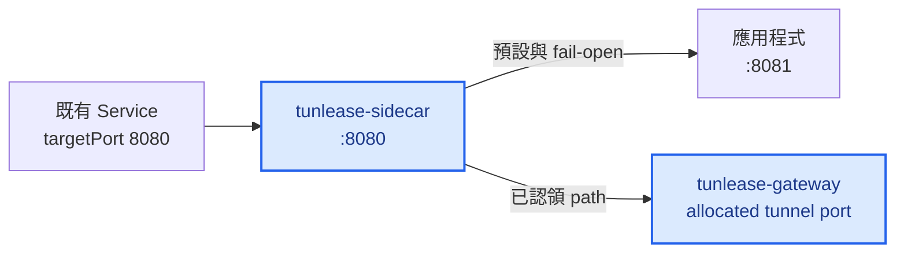
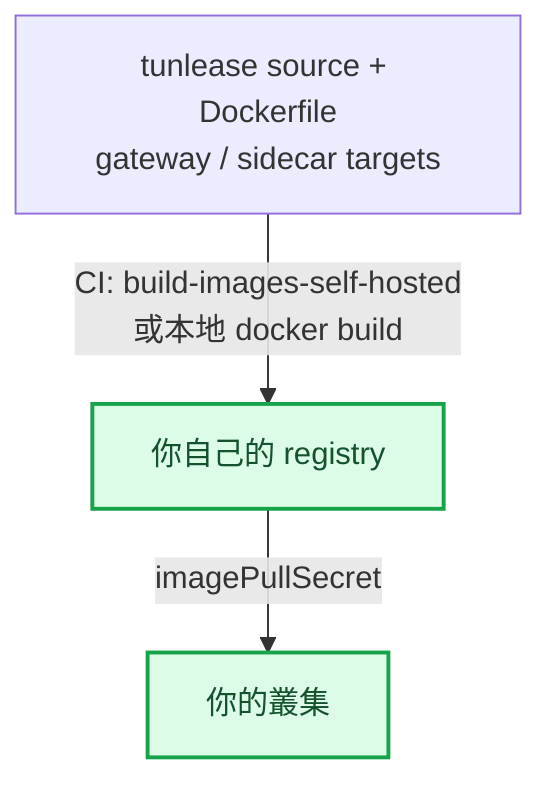

# 平台部署指南

[English](platform-deployment.md) · [繁體中文](platform-deployment.zh-TW.md)

部署分成兩部分：安裝共用的 `tunlease-gateway`，再把 `tunlease-sidecar` 加到擁有第三方固定 endpoint 的 workload。Sidecar 不改 public URL；它接手既有 Service port，並把未認領或失敗的流量轉回同一個 Pod 裡的 app。

完整 control plane、data plane、routing 與 Pod replacement 流程請看[架構](architecture.zh-TW.md)。



藍色節點由本 repo 部署；其他節點屬於既有服務。

## 部署前決定

- 選擇 internal/staging Ingress host 與 path，例如 `tunlease.example.com`。
- Path allowlist 是 optional：留空則允許任意 path（可信網路下方便），或設定涵蓋你 callback 的最小前綴，避免有人 claim `/` 或 `/admin` 這類敏感 path。
- Client token 是 optional。Gateway 位於可信開發網路之外時，應為每位開發者設定獨立 token。Sidecar 讀 route table 用的 token 與 client token 是不同的 secret，但 gateway 與 sidecar 兩邊必須設成*同一個*值（見[加入 Sidecar](#加入-sidecar)）。
- v1 gateway 保持單一 replica。Staging 預設使用 memory registry；Pod replacement 時 CLI 會重新 claim，sidecar 暫時把流量送回 app。只有明確需要持久租約或多 replica 時才使用 Redis。
- 確認 Ingress 支援 WebSocket upgrade，read/send timeout 至少 3600 秒。

## 自架前提

Chart 與 `deploy/sidecar-patch.yaml` 預設使用 placeholder registry、Ingress
controller 與 host。要部署到自己叢集的團隊必須先處理三件事，否則 gateway 起不來或連不到。

關鍵在 image 來源：叢集只能從它有憑證的 registry 拉 image。你必須把 image 推到叢集
能拉的 registry，再讓 chart 指向它：



- **Image。** `charts/tunlease/values.yaml` 與 `deploy/sidecar-patch.yaml` 指向
  placeholder registry（`your-registry.example.com/...`）。對所設定 registry 沒有
  pull 權限的叢集，Pod 會 `ImagePullBackOff`。請取得該 registry 的 pull secret，
  或把 image build/push 到你自己的 registry。repo 附了一個 manual CI job
  `build-images-self-hosted` 專做這件事——它 build 兩個 target 並推到
  `TARGET_REGISTRY`。當你把 `TARGET_REGISTRY` 指到自己的 registry 時，也要設
  `REGISTRY_HOST`/`REGISTRY_USER`/`REGISTRY_PASSWORD`，讓 login 一併指向它。
  若要本地 build：

  ```bash
  # 用 repo 的 Dockerfile build 兩個 target 並 push 到你的 registry。
  docker build --target gateway -t YOUR_REGISTRY/tunlease-gateway:TAG .
  docker build --target sidecar -t YOUR_REGISTRY/tunlease-sidecar:TAG .
  docker push YOUR_REGISTRY/tunlease-gateway:TAG
  docker push YOUR_REGISTRY/tunlease-sidecar:TAG
  ```

  然後在 values 設 `image.repository`/`image.tag`，改 patch 裡的 sidecar image，
  並為你的 registry 加上 `imagePullSecret`。

- **Ingress controller。** Chart 寫死 `ingressClassName: nginx` 與
  `nginx.ingress.kubernetes.io/*` annotation，其中 `rewrite-target: /$2` 的
  capture-group 行為是 ingress-nginx 特有的。換成其他 controller（Traefik、AWS
  ALB…）時，`ingress.className` 與每個 annotation 都要換成該 controller 對應的
  path rewrite 與 WebSocket timeout 設定。

- **DNS 與 TLS。** 沒有任何東西會幫你供應 host。請把你選的 host（chart 預設
  `tunlease.example.com`）指到你的 Ingress，並為它簽發憑證。下方 quick start
  為求簡潔用 `http://`，但 tunnel handshake 是 `wss://`（見 [spec-v1](spec-v1.zh-TW.md)）；
  production gateway 必須在該 host 上終結 TLS。

### CI 部署範例

若你從 CI 部署到一個已經在共用 deploy template 裡處理好雲端憑證、registry login
與 `kubectl` context 的叢集，job 只需要建 secret 再 apply manifest：

```yaml
tunlease-staging:
  extends: .deploy-template   # 你自己的共用 deploy template
  stage: staging
  when: manual
  variables:
    NAMESPACE: tunlease
    DEPLOY_FOLDER: ./tunlease
  script:
    - cd ${DEPLOY_FOLDER}
    # 用 perl 字面替換（非 raw sed），避免輪換後的 token 含 & | \ 或引號時破壞 config。
    - TUNLEASE_SIDECAR_TOKEN="$TUNLEASE_SIDECAR_TOKEN" perl -pe 's/\$\{TUNLEASE_SIDECAR_TOKEN\}/$ENV{TUNLEASE_SIDECAR_TOKEN}/g' config.stg.tmpl.yaml > /tmp/tunlease-config.yaml
    - kubectl create secret generic tunlease-gateway-config -n ${NAMESPACE} --from-file=config.yaml=/tmp/tunlease-config.yaml --dry-run=client -o yaml | kubectl apply -f -
    - kubectl create secret generic tunlease-sidecar-auth -n ${NAMESPACE} --from-literal=token="${TUNLEASE_SIDECAR_TOKEN}" --dry-run=client -o yaml | kubectl apply -f -
    - kubectl apply -f deployment-stg.yaml
    - kubectl rollout status deployment/tunlease-gateway -n ${NAMESPACE} --timeout=120s
```

`TUNLEASE_SIDECAR_TOKEN` 是 masked CI/CD 變數；同一個值建出兩個 secret，因此天然一致。

若你的共用 template 寫死了特定叢集名稱或 registry，不要 `extends` 它。保留上面的
`script` 步驟，但改用你自己的 `before_script` 去認證你的 registry 並設定你的
`kubectl` context。

## 安裝 Gateway

Chart 預設為 `auth.tokens: []`，也就是停用 client authentication。這適合可信的開發網路，但所有能連到 gateway 的 client 都會共用 `anonymous` owner，也都能列出或釋放任何 claim。

若要啟用認證，真實 token 絕對不要 commit。使用受控的 private values 或 CI secret：

```yaml
# values.private.yaml — 不要 commit
image:
  tag: IMAGE_VERSION
config:
  registry: redis
  redisURL: redis://redis.example:6379/0
  whitelist:
    - /webhooks/provider/
auth:
  sidecarToken: SIDECAR_TOKEN
  tokens:
    - owner: alice
      token: ALICE_TOKEN
```

```bash
helm upgrade --install tunlease charts/tunlease \
  --namespace tunlease --create-namespace \
  -f values.private.yaml

kubectl -n tunlease rollout status deployment/tunlease
```

Chart 預設使用 `/tunlease` Ingress path，並 rewrite 到 gateway root。`/api/v1/*` 與 `/tunnel` 共用 host/path；不要移除 WebSocket upgrade headers。

Route 的 `tunnel_addr` 是 gateway Pod IP，所以 v1 必須維持 `replicaCount: 1`。Service 只承載 API 與 tunnel establishment；sidecar 會直接連 allocated remote port。

## 加入 Sidecar

[deploy/sidecar-patch.yaml](../deploy/sidecar-patch.yaml) 是 strategic merge 範例。實際修改必須 commit 到目標服務有版本控制的 repo。

1. 把 app 移到新的 Pod-local port，例如 `8081`。
2. 讓 sidecar listen Service 原本的 `targetPort`，例如 `8080`。
3. `TUNLEASE_APP_URL` 指向 `http://127.0.0.1:8081`。
4. `TUNLEASE_ROUTES_URL` 指向 gateway Service 的 `/api/v1/routes`。Service 名稱是
   `<helm-release-名>-gateway`（release 叫 `tunlease` 就是
   `http://tunlease-gateway/api/v1/routes`）。若 sidecar 在不同 namespace，用完整
   名稱 `<release>-gateway.<namespace>.svc`。
5. 從 Kubernetes Secret 載入 `TUNLEASE_SIDECAR_TOKEN`。
6. App probe 改到新 port；sidecar 使用 TCP 或專用 health probe。
7. 不要修改第三方保存的 public Ingress、host 或 endpoint。

建立 sidecar credential。它的 token **必須等於** gateway 的 `auth.sidecarToken`
值——兩者不同時 gateway 會用 `401` 拒絕 `/api/v1/routes`，這是 sidecar 啟動失敗
最常見的原因：

```bash
# $SIDECAR_TOKEN 必須與 gateway values 的 auth.sidecarToken 是同一個值。
kubectl -n tunlease create secret generic tunlease-sidecar-auth \
  --from-literal=token="$SIDECAR_TOKEN" \
  --dry-run=client -o yaml | kubectl apply -f -
```

Rollout 後確認兩個 container 都 Ready，並先測試未認領 path 仍由 app 正常處理。

## 失敗語意

- Route API 無法連線時，sidecar 最多保留舊 route table 60 秒；之後清空並把全部流量送到 app。
- Tunnel dialing 或 response header 超過一秒時，該 request 立即 fallback 到 app。
- Gateway 或 CLI 故障只能影響開發 tunnel，不能影響原始服務可用性。
- Sidecar 不驗證 claim；它的專用 token 只能讀 routes。

使用 memory registry 時，替換 gateway Pod 會刻意移除所有 claim。CLI 在 heartbeat 發現 lease 消失後重新 claim 並建立 tunnel；中間 sidecar fail-open。Redis 可以保留 lease record，但無法保留 tunnel session 或 Pod IP，因此仍不能免除 reconnect。

## 驗證部署

```bash
# Gateway health
curl -fsS http://GATEWAY_HOST/tunlease/healthz

# Routes endpoint 必須要求 sidecar token。
curl -o /dev/null -w '%{http_code}\n' \
  http://GATEWAY_HOST/tunlease/api/v1/routes              # 預期 401
curl -fsS -H "Authorization: Bearer $SIDECAR_TOKEN" \
  http://GATEWAY_HOST/tunlease/api/v1/routes

kubectl -n tunlease get pods
kubectl -n tunlease logs deployment/TARGET -c tunlease-sidecar --since=10m
```

完整 E2E：先確認未認領 path 到 app；執行 `tunle claim` 後確認 public URL 到 localhost；Ctrl+C 後確認回到 app；最後中斷 tunnel 或 gateway，確認仍然 fail-open。

## Observability

Sidecar 預設在 `:9090/metrics` 提供：

- `devproxy_sidecar_requests_total{route="app|tunnel|fallback"}`
- `devproxy_sidecar_routes_age_seconds`
- `devproxy_sidecar_route_fetch_errors_total`

Gateway 會寫出 claim、release、expiry 的 JSON audit event，包含 owner、path、claim ID 與時間。建議針對 route age、fetch error 與異常增加的 fallback traffic 設 alert。

## Rollback

先停止建立新 claim，再把 workload rollback 到沒有 sidecar、app 使用原始 port 的 manifest。Public Service 與 Ingress 不需要改。沒有 consumer 後，可保留 gateway 或執行 `helm uninstall tunlease -n tunlease` 移除。
